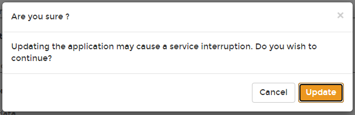

# Detach a volume from an application

From the menu select **Applications**, select the application then click **Edit this application**.

Scroll down to the **Persisting data** section and click the trash can icon to the right of the volume. Scroll down and click **Update application**. When the confirmation message appears, click **Update**.

