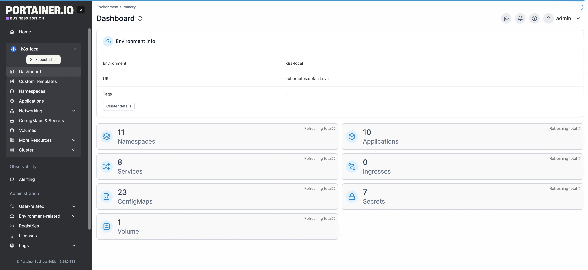
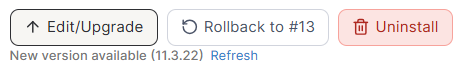
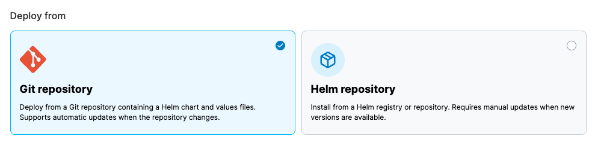
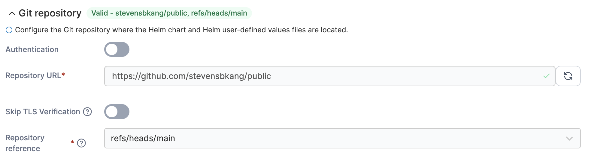
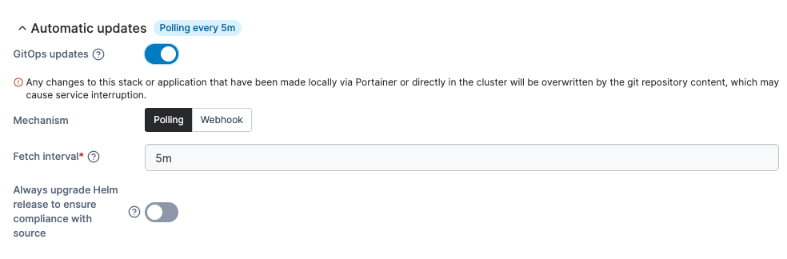
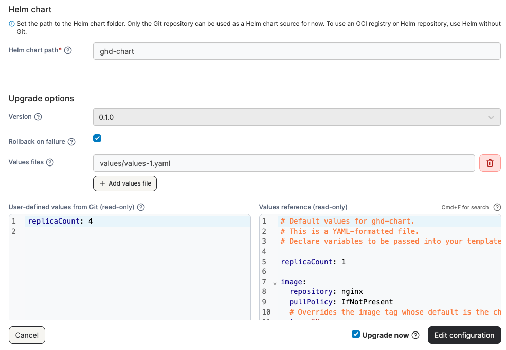

---
metaLinks:
  alternates:
    - >-
      https://app.gitbook.com/s/j6QEqM3Sd94bdPsX4HaN/user/kubernetes/applications/edit-helm
---

# Edit a Helm application

From the menu select **Applications** and select the Helm application you want to edit or upgrade.

<figure><figcaption></figcaption></figure>

With Helm chart versioning, a Helm deployment can be upgraded or downgraded through Portainer. If a newer version of your currently deployed chart is available, a new version notification will be displayed on under the **Edit/Upgrade** button. You can click the **Refresh** link to update the list of versions from the chart source.

<figure><figcaption></figcaption></figure>

To make changes to, upgrade, or downgrade a Helm deployment, click **Edit/Upgrade**.

In the popup that appears, choose whether to edit using deployment details from a **Git repository** or a **Helm repository**. This option defaults to the method originally used when creating the application, but you can change it if needed.

<figure><figcaption></figcaption></figure>

## Git repository

If the application was deployed from a Git repository you can view or edit your Git configuration defined during setup.


For more details on the fields you can edit in this view, see the documentation on [setting up a Helm application from a Git repository](manifest/helm.md#git-repository).


A tag showing the **repository** and **reference** indicates whether the current setup is **Valid** or **Invalid**. Click the **Git repository** title to expand the section and edit the details.

<figure><figcaption></figcaption></figure>

You can modify Automatic update options from this view. If **GitOps updates** are enabled, a tag showing the configured update timeframe is displayed next to the title. Click the **Automatic updates** title to expand the section and edit the settings.

<figure><figcaption></figcaption></figure>

You can edit the **Helm chart path** in this view. The specified folder must contain a `Chart.yaml` file.

Under **Upgrade options**, you can view the **Version** of the Helm chart as defined in the `Chart.yaml` file from the specified Helm chart path. This field is read-only and cannot be changed when deploying from Git.

Select **Rollback on failure** to automatically delete the installation if it fails for any reason. This option is equivalent to using the `--atomic` flag in Helm.

You can also specify one or more **Values files** to override the default chart values. If multiple files are listed, they are merged in the order specified, with the last file taking precedence.


You can get more information about the Helm values file format in the [official Helm documentation](https://helm.sh/docs/chart_template_guide/values_files/).


**User-defined values from Git** and the **Values reference** are displayed side by side, showing the values that will be applied during the upgrade. These views are read-only. You can expand the **Manifest preview** section below the values comparison to display a preview of the resulting merged manifest.

Tick the **Upgrade now** box to apply the upgrade immediately, instead of waiting for the next poll or webhook trigger.

<figure><figcaption></figcaption></figure>

When you're ready, click **Edit configuration**. The upgrade will begin, and you'll be returned to the application's details page.

The **Status** of the upgrade is displayed on the details page, and you can view the **Events** tab for more detailed information.

## Helm repository

In this view, you can change the **Helm chart source** and select the registry or repository where the chart is located. Under **Helm chart**, choose a registry to load the available Helm charts.

Choose the **chart version** you want to switch to (your current version is labeled) and make any necessary adjustments to the values in the **User-defined values** view. The default **values reference** for the selected version are displayed on the right as a read-only reference.

To preview the manifest that will be created from the updated Helm chart, click the **Manifest preview** header.

You can also choose to **Rollback on failure** by selecting the corresponding checkbox.

When you're ready, click **Edit/Upgrade**. The upgrade will begin and you will be returned to the details page for the application.

<figure><figcaption></figcaption></figure>
