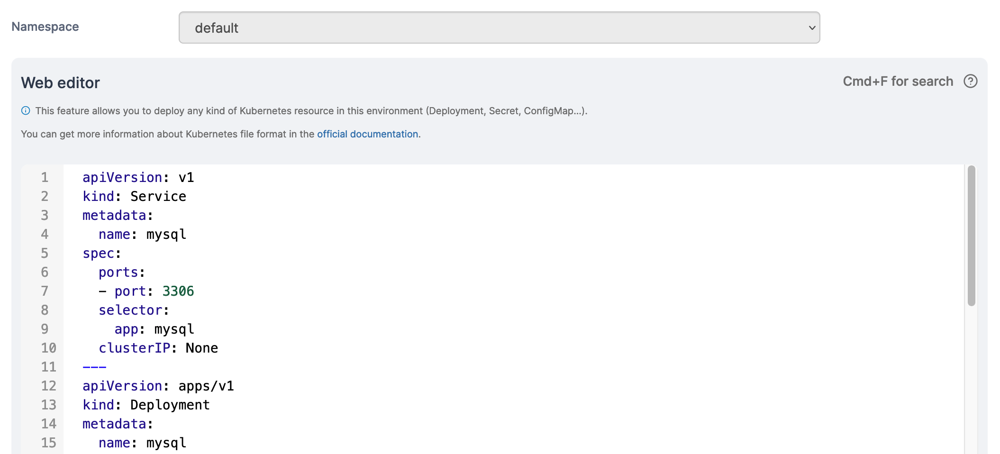

# Edit an application

From the menu select **Applications**, select the application you want to edit, then click **Edit this application**.

<figure><figcaption></figcaption></figure>

Depending on how the application was deployed, you will either be able to redeploy the application from Git or edit the application's YAML directly.

## Method 1: Redeploy from Git

If the application was [deployed from a Git repository](manifest.md#option-1-git-repository) you can redeploy it from the repository if needed. You will see the repository URL that the application was deployed from, and the file used for the deployment.

<figure><figcaption></figcaption></figure>

You can reconfigure authentication here if needed.

<figure><figcaption></figcaption></figure>

If you want to redeploy, click **Pull and update application**. If you're simply updating the repository settings and don't need to redeploy, click **Save settings**.

## Method 2: Edit manually

If the application was not deployed from a Git repository, you can edit its manifest directly in Portainer.&#x20;


You can search within the web editor at any time by pressing `Ctrl-F` (or `Cmd-F` on Mac).


<figure><figcaption></figcaption></figure>

Make the required changes then click **Update the application**.

