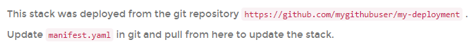
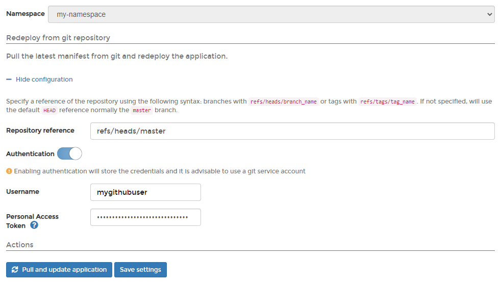
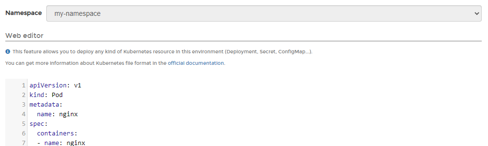

# Edit an application

From the menu select **Applications**, select the application you want to edit, then click **Edit this application**.

Depending on how the application was deployed, you will either be able to redeploy the application from Git or edit the application's YAML directly.

## Method 1: Redeploy from Git

If the application was [deployed from a Git repository](manifest.md#option-1-git-repository) you can redeploy it from the repository if needed. You will see the repository URL that the application was deployed from, and the file used for the deployment.

You can change the **Repository reference** if needed, and reconfigure authentication.

If you want to redeploy, click **Pull and update application**. If you're simply updating the repository settings and don't need to redeploy, click **Save settings**.

## Method 2: Edit manually

If the application was not deployed from a Git repository, you can edit its manifest directly in Portainer.&#x20;

Make the required changes then click **Update the application**.

