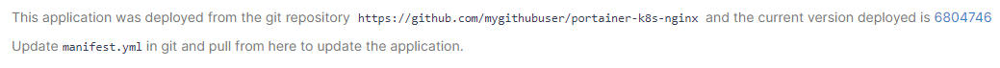
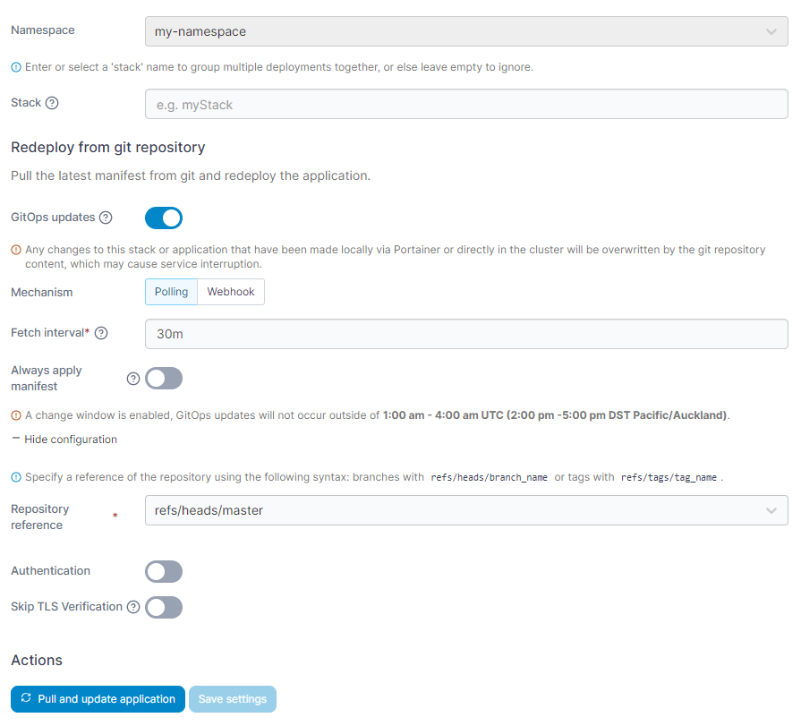
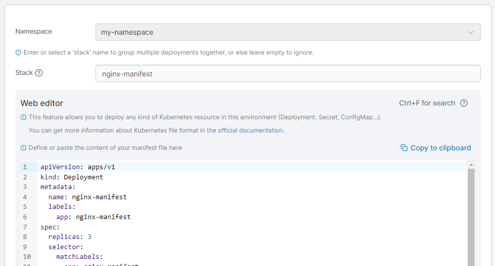

# Edit an application

From the menu select **Applications**, select the application you want to edit, then click **Edit this application**.

<figure><figcaption></figcaption></figure>

Your editing options will depend on how the application was deployed initially.


Regardless of the deployment method, you can [edit an application's YAML directly](inspect.md#yaml-tab) through the YAML tab in Portainer Business Edition.


## Applications deployed from Git

If the application was [deployed from a Git repository](manifest.md#repository) you can redeploy it from the repository if needed. You will see the repository URL that the application was deployed from, the current version deployed, and the file used for the deployment.

<figure><figcaption></figcaption></figure>

You can reconfigure GitOps updates, the repository reference and authentication here if needed. If a change window is enabled, information on it will appear here as well.

<figure><figcaption></figcaption></figure>

If you want to redeploy, click **Pull and update application**. If you're simply updating the repository settings and don't need to redeploy, click **Save settings**.

## Applications deployed from the Web Editor

If the application was deployed from the Web Editor, you will be given the ability to edit the manifest manually.&#x20;


You can search within the web editor at any time by pressing `Ctrl-F` (or `Cmd-F` on Mac).


<figure><figcaption></figcaption></figure>

Make the required changes then click **Update application**.

## Applications deployed from a form or Helm

When editing an application deployed from a form or Helm, you will be able to update the configuration using the same form. Refer to [adding a new application using a form](add.md) for details.

