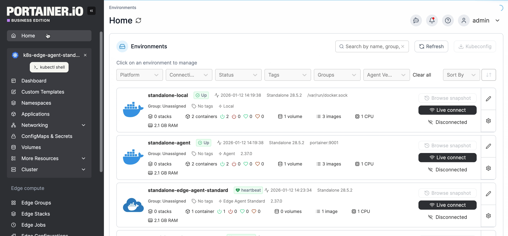
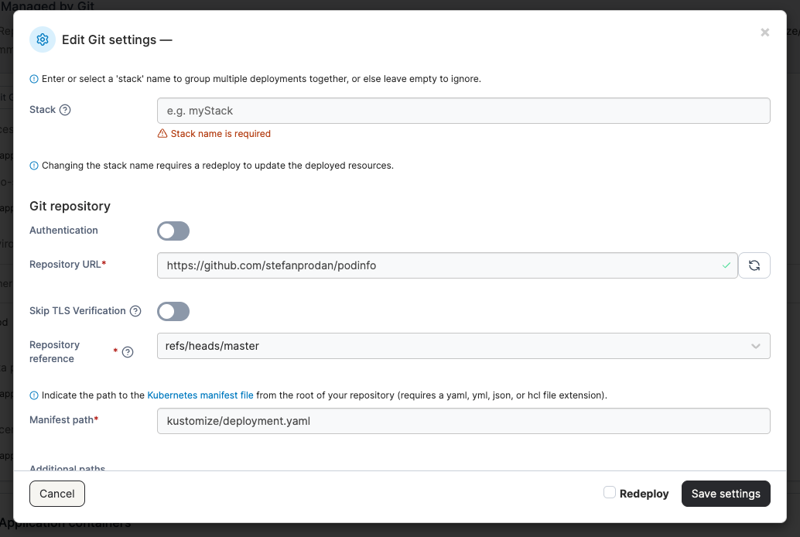
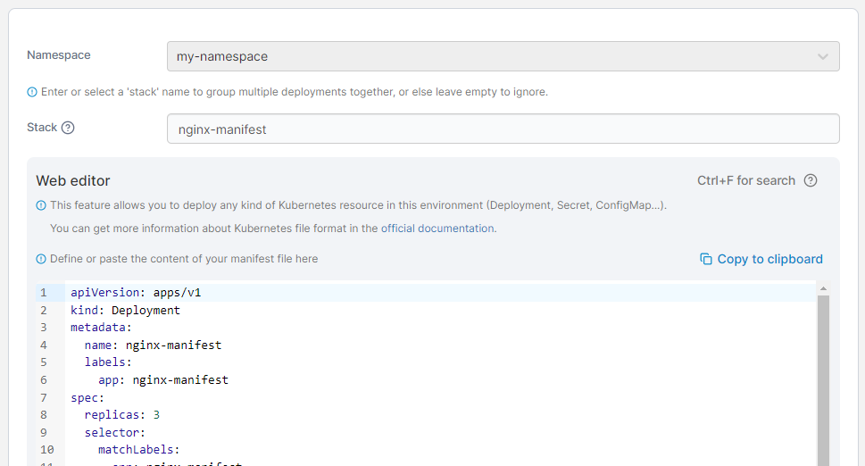

---
metaLinks:
  alternates:
    - >-
      https://app.gitbook.com/s/MdgxA76kWxcRmwybM8Ft/user/kubernetes/applications/edit
---

# Edit an application

From the menu select **Applications**, select the application you want to edit, then click **Edit this application**, **Edit external application**, or **Edit Git settings**.

<figure><figcaption></figcaption></figure>

Your editing options will depend on how the application was deployed initially.


Regardless of the deployment method, you can [edit an application's YAML directly](inspect.md#yaml-tab) through the YAML tab in Portainer Business Edition.


## Applications deployed from Git

If the application was [deployed from a Git repository](manifest/#repository) you can edit any [Git settings](manifest/create.md#repository) that you set on the application deployment.

<figure><figcaption></figcaption></figure>

If you want to redeploy, select the **Redeploy** tickbox before saving. If you're simply updating the repository settings and don't need to redeploy, click **Save settings**.

If you need to **pull and redeploy**, this can be done from the application view.

<figure><figcaption></figcaption></figure>

## Applications deployed from the Web Editor

If the application was deployed from the Web Editor, you will be given the ability to edit the manifest manually.&#x20;


You can search within the web editor at any time by pressing `Ctrl-F` (or `Cmd-F` on Mac).


<figure><figcaption></figcaption></figure>

Make the required changes then click **Update application**.

## Applications deployed from an Edge Stack

If the application was deployed from an Edge stack, selecting **Edit this application** redirects you to the [Edit Edge Stacks page](../../edge/stacks/), where you can view the stack details or modify the stack.

## Applications deployed from a form

When editing an application deployed from a form, you will be able to update the configuration using the same form. Refer to [adding a new application using a form](add.md) for details.
