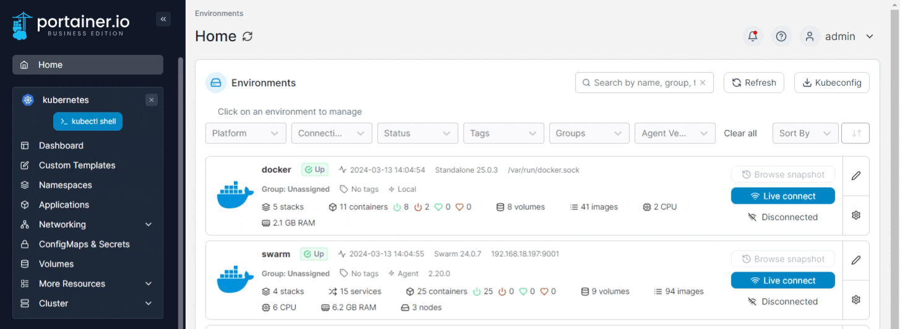
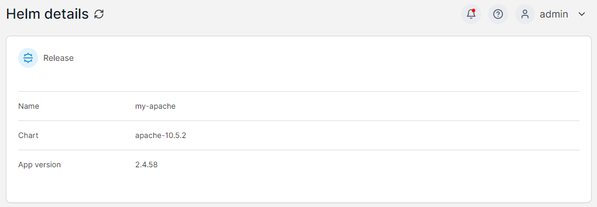
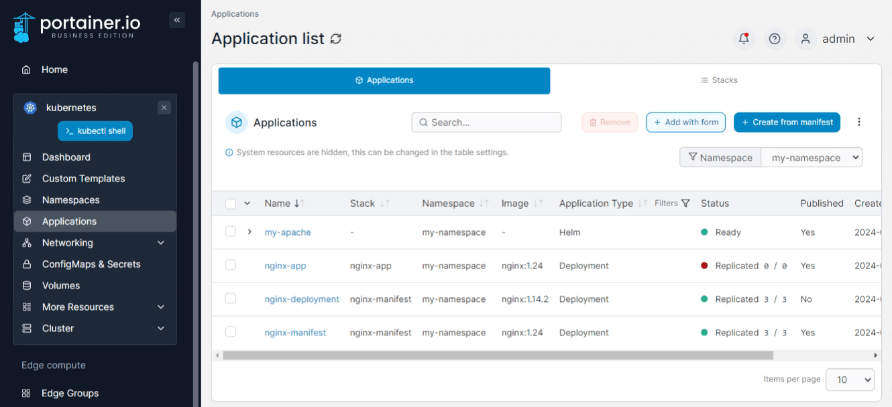
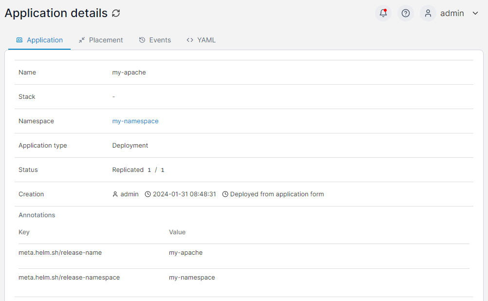

# Inspect a Helm application

To view information about Helm applications running in a cluster, from the menu select **Applications** then select the Helm application you want to inspect.

<figure><figcaption></figcaption></figure>

You will be shown details about the Helm application including the name, chart used for the deployment, and the application version.

<figure><figcaption></figcaption></figure>

To view information about a specific deployment within a Helm application, from the **Applications** page expand the Helm application by clicking the arrow to the left of the application name then click the name of a deployment within the application.

<figure><figcaption></figcaption></figure>

Here you can view full details of the individual deployment within the Helm application.

<figure><figcaption></figcaption></figure>

For more detail on the contents of this page, refer to [Inspect an application](inspect.md).
