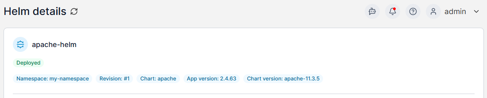
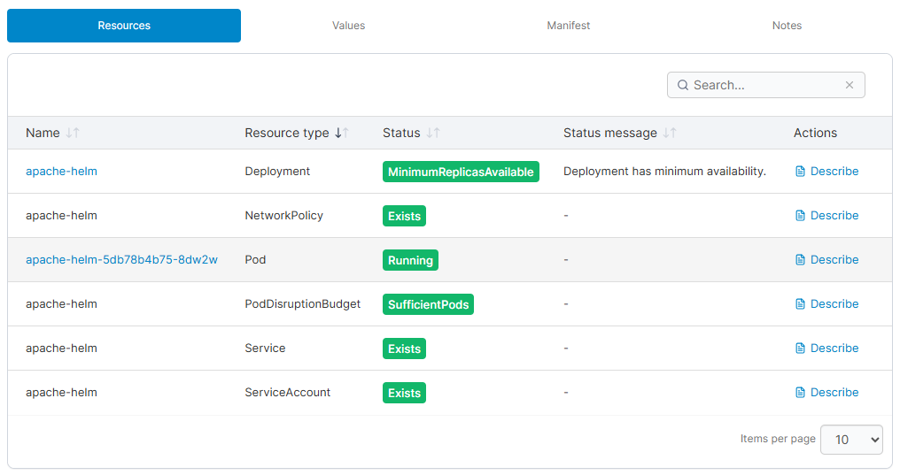
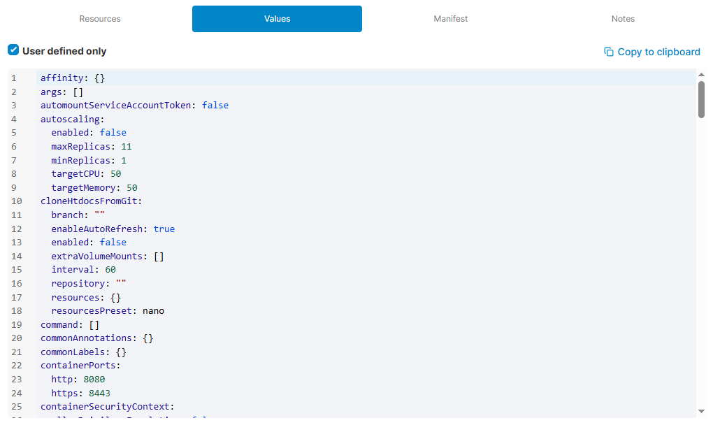
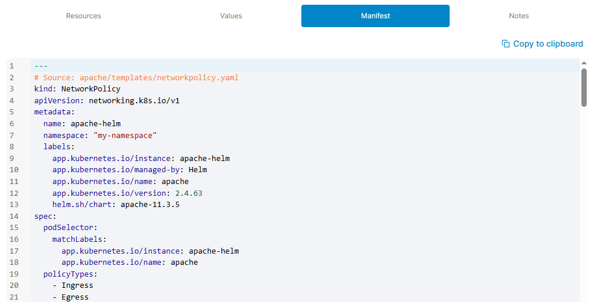
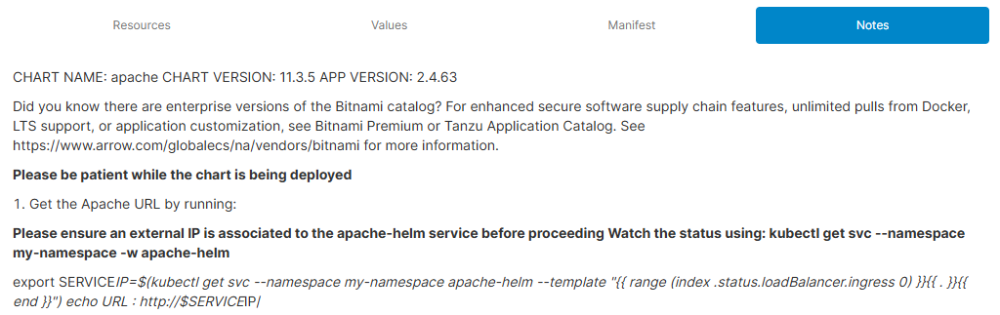

# Inspect a Helm application

To view information about Helm applications running in a cluster, from the menu select **Applications** then select the Helm application you want to inspect.

<figure><figcaption></figcaption></figure>

You will be shown details about the Helm application including the name, namespace, revision, chart used for the deployment, the application version, and the chart version.&#x20;

<figure><figcaption></figcaption></figure>

You will also see four tabs that provide additional information about your Helm deployment: [Resources](inspect-helm.md#resources), [Values](inspect-helm.md#values), [Manifest](inspect-helm.md#manifest) and [Notes](inspect-helm.md#notes).

## Resources

The **Resources** tab displays information about the resources that make up your Helm deployment. The items listed here will vary depending on the contents of your Helm chart. The **Name**, **Resource type**, **Status**, **Status message** and **Actions** are shown for each resource.

<figure><figcaption></figcaption></figure>

Click on the name of select resource types (such as Deployments and Pods) to [view details of that specific resource](inspect.md). Clicking the **Describe** link for a resource will display a raw description of the resource in a popup window.

<figure><figcaption></figcaption></figure>

## Values

The **Values** tab shows the raw values set on the deployment. You can check the **User defined only** option to display only those options explicitly specified by the chart, or untick it to show all values including globally set options.

<figure><figcaption></figcaption></figure>

## Manifest

The **Manifest** tab displays the raw manifest used to deploy the Helm chart.

<figure><figcaption></figcaption></figure>

## Notes

The **Notes** tab displays any notes that were attached to the Helm chart when it was deployed.

<figure><figcaption></figcaption></figure>
