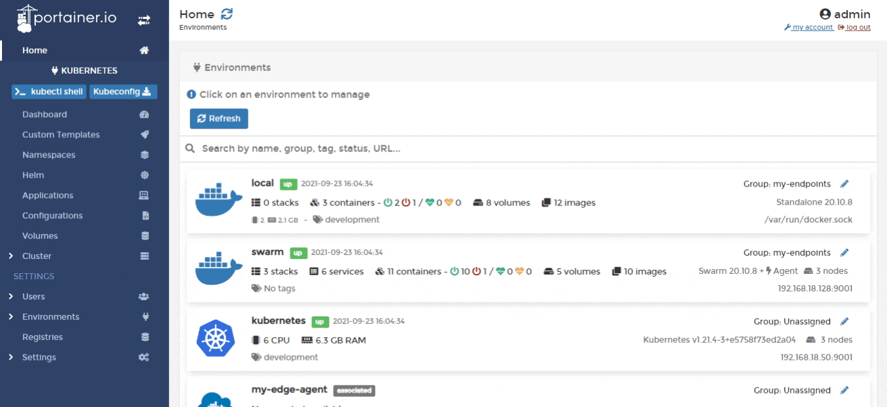
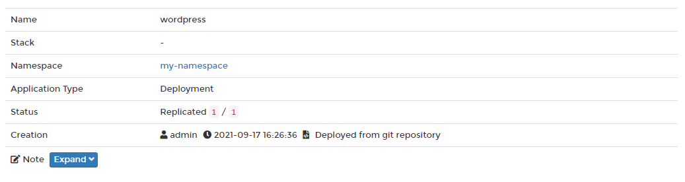
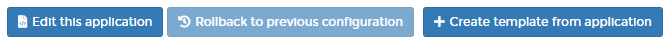
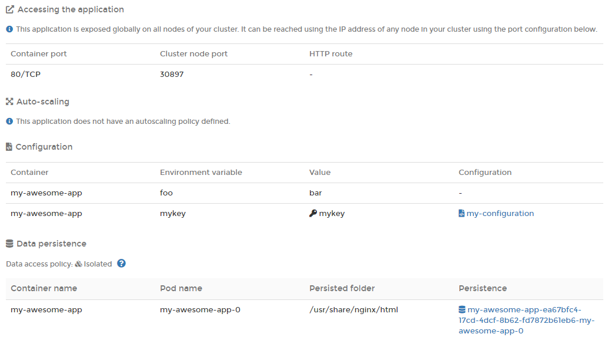
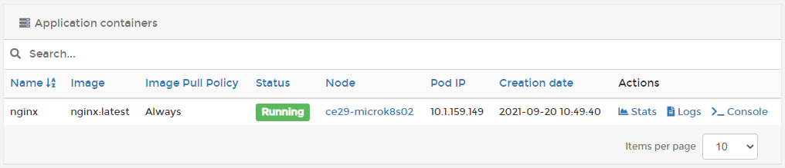
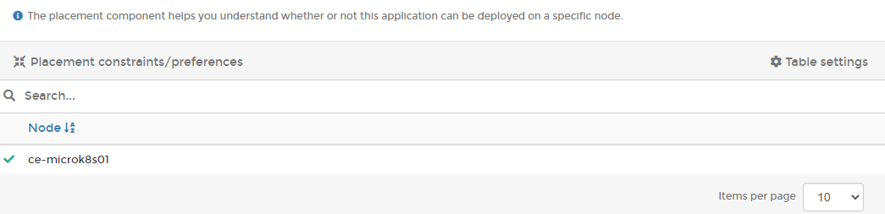
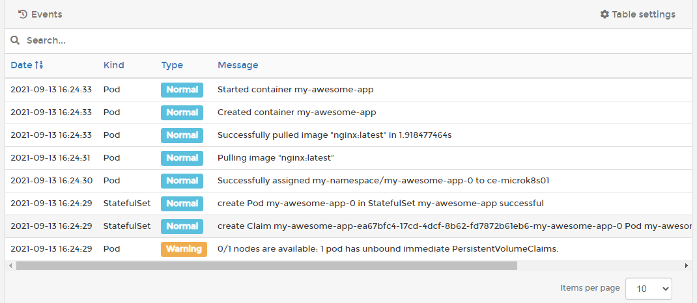
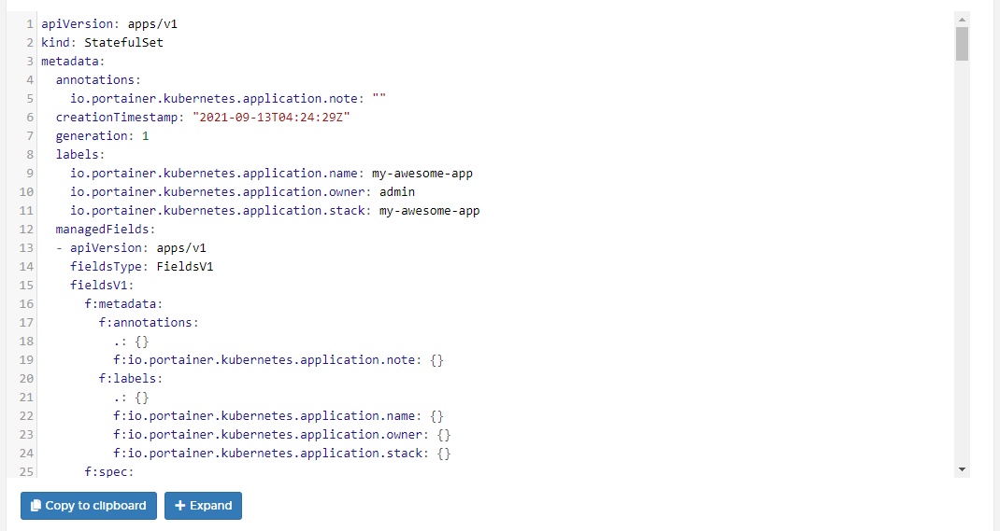

# Inspect an application

To view information about applications running in a cluster, from the menu select **Applications** then select the application you want to inspect.

The **Application details** screen is organized into four sections. The following tables explain all of the information to be found in each.

## Application information section

### General information

| Attribute        | Overview                                                                                                                             |
| ---------------- | ------------------------------------------------------------------------------------------------------------------------------------ |
| Name             | The name of the application.                                                                                                         |
| Stack            | The stack that the application belongs to (if any).                                                                                  |
| Namespace        | The namespace that the application is running in.                                                                                    |
| Application Type | The type of application (Pod, Deployment, StatefulSet, DaemonSet, etc).                                                              |
| Status           | Indicates whether or not the application is running. Where applicable, this also shows the replication state and number of replicas. |
| Creation         | Shows when the application was created and by whom, as well as how the application was deployed.                                     |
| Note             | Add a note about the application or edit an existing note.                                                                           |

### Actions

Depending on how the application was deployed, a number of actions can be performed, including:

* [Editing the application](edit.md).
* Rolling the application back to a previous configuration.
* Creating a [template](../templates/) from the application.

### Configuration details

| Configuration             | Overview                                                                                           |
| ------------------------- | -------------------------------------------------------------------------------------------------- |
| Accessing the application | Shows which ports (if any) are published from the container.                                       |
| Auto-scaling              | Indicates the application's auto-scaling policy.                                                   |
| Configuration             | A list of any environment variables and configurations that have been defined for the application. |
| Data persistence          | A list of the persistent folders and their details.                                                |

### Pod details

See which pods run your application, which image is being used, the status, node, and IP address of the pod, and when each pod was created. You can also access the pod stats, console and logs from here.

## Placement section

Here you'll find information about any placement constraints or preferences that have been defined for the application and how they're being applied.

## Events section

Shows information about application-related events.

## YAML section

This displays the YAML generated from the application deployment. Use it to create backups of the configuration.

