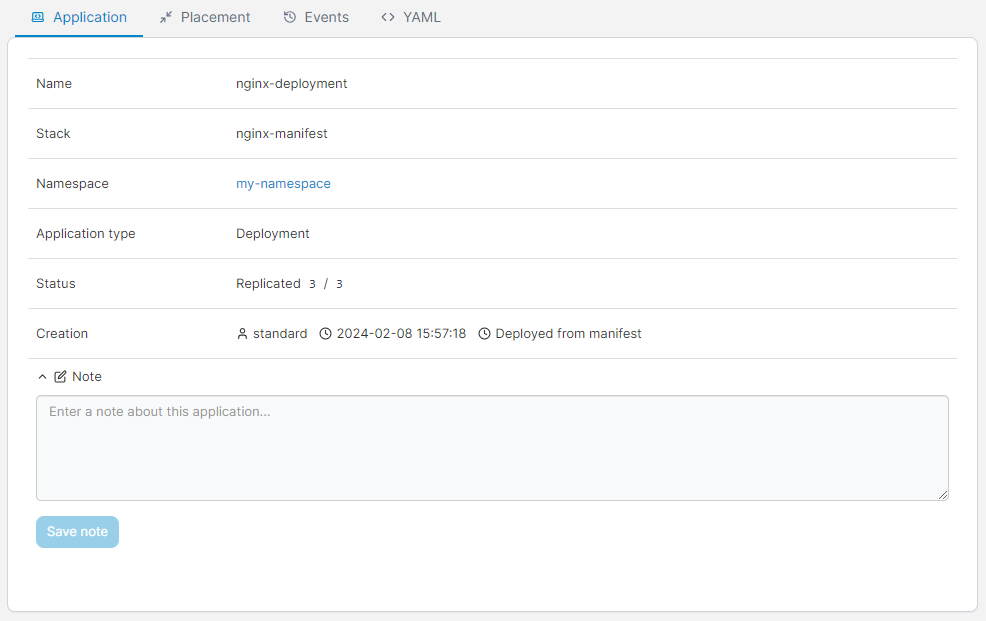
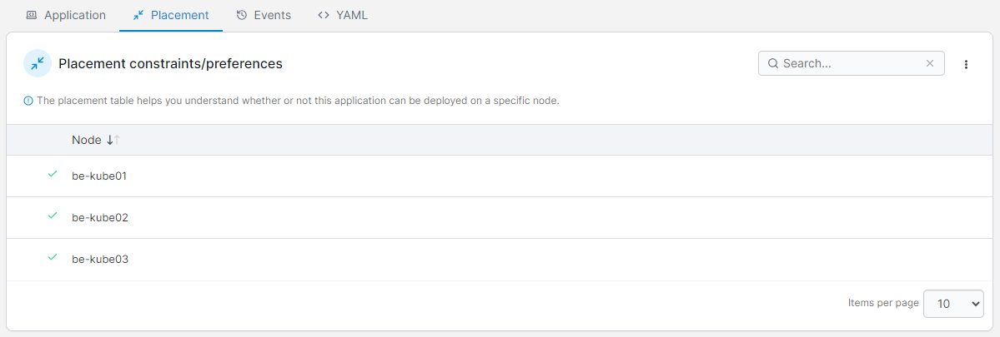
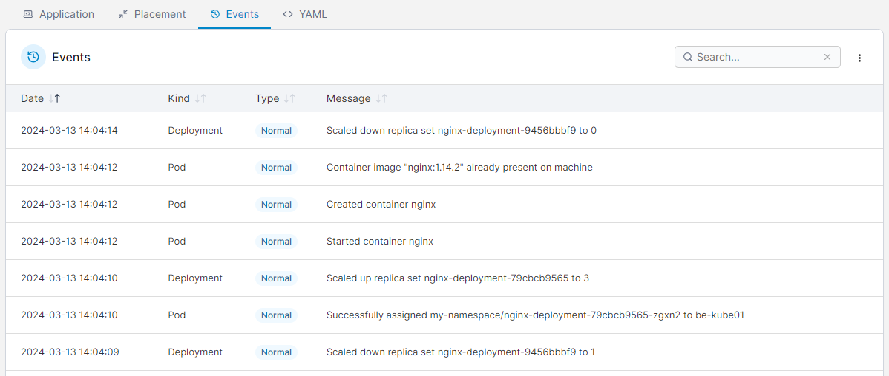
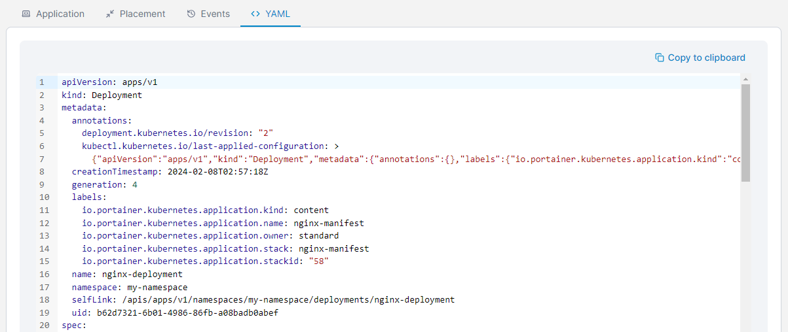
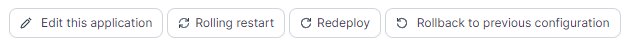
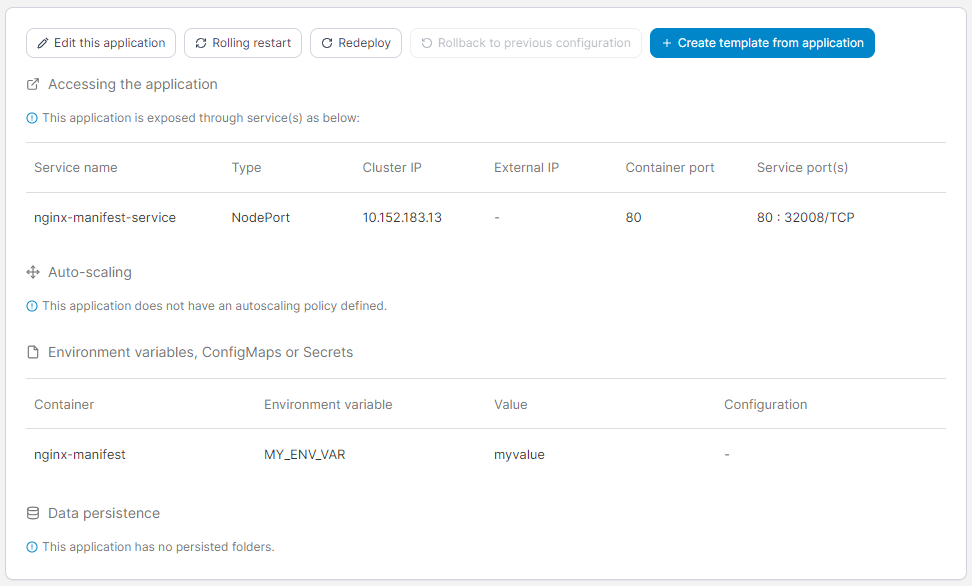
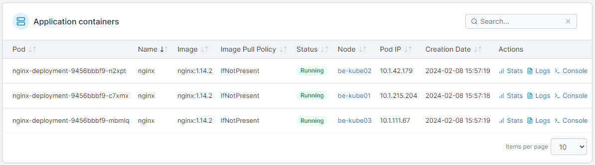

# Inspect an application

To view information about applications running in a cluster, from the menu select **Applications** then select the application you want to inspect.

<figure><figcaption></figcaption></figure>

The **Application details** screen is organized into four sections. The following tables explain all of the information to be found in each.

## Application tab

| Attribute        | Overview                                                                                                                             |
| ---------------- | ------------------------------------------------------------------------------------------------------------------------------------ |
| Name             | The name of the application.                                                                                                         |
| Stack            | The stack that the application belongs to (if any).                                                                                  |
| Namespace        | The namespace that the application is running in.                                                                                    |
| Application Type | The type of application (Pod, Deployment, StatefulSet, DaemonSet, etc).                                                              |
| Status           | Indicates whether or not the application is running. Where applicable, this also shows the replication state and number of replicas. |
| Creation         | Shows when the application was created and by whom, as well as how the application was deployed.                                     |
| Note             | Add a note about the application or edit an existing note.                                                                           |

<figure><figcaption></figcaption></figure>

## Placement tab

Here you'll find information about any placement constraints or preferences that have been defined for the application and how they're being applied.

<figure><figcaption></figcaption></figure>

## Events tab

Shows information about application-related events.

<figure><figcaption></figcaption></figure>

## YAML tab

This displays the YAML generated from the application deployment, and lets you edit the YAML for an application directly. Updates to your manifest made here are applied using the Kubernetes `patch` mechanism.&#x20;


Editing your YAML through this section is only available in Portainer Business Edition.


<figure><figcaption></figcaption></figure>

Make your edits then click **Apply changes** to update the deployment.


Editing the YAML is not available for resources in namespaces marked as system.


## Actions

Depending on how the application was deployed, a number of actions can be performed, including:

* [Editing the application](edit.md).
* Perform a rolling restart of the application (Business Edition only).
* Redeploying the application (terminating all the services and recreating them).
* Rolling the application back to a previous configuration.
* Creating a [template](../templates/) from the application.


When using a Git repository, the rolling restart and redeploy options do not re-pull the manifest from the upstream repository. To do this, use the **Pull and update application** button when [editing an application](edit.md#method-1-redeploy-from-git).


<figure><figcaption>
Some of the potential actions that may appear for your application
</figcaption></figure>

### Configuration details

| Configuration                                | Overview                                                                                                |
| -------------------------------------------- | ------------------------------------------------------------------------------------------------------- |
| Accessing the application                    | Shows which ports (if any) are published from the container.                                            |
| Auto-scaling                                 | Indicates the application's auto-scaling policy.                                                        |
| Environment variables, ConfigMaps or Secrets | A list of any environment variables, ConfigMaps and secrets that have been defined for the application. |
| Data persistence                             | A list of the persistent folders and their details.                                                     |

<figure><figcaption></figcaption></figure>

## Application containers

See which pods run your application, which image is being used, the status, node, and IP address of the pod, and when each pod was created. You can also access the pod stats, console and logs from here.

<figure><figcaption></figcaption></figure>
