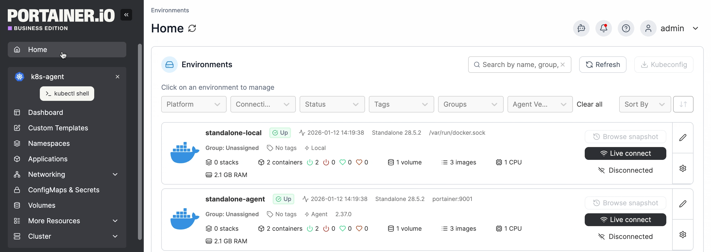
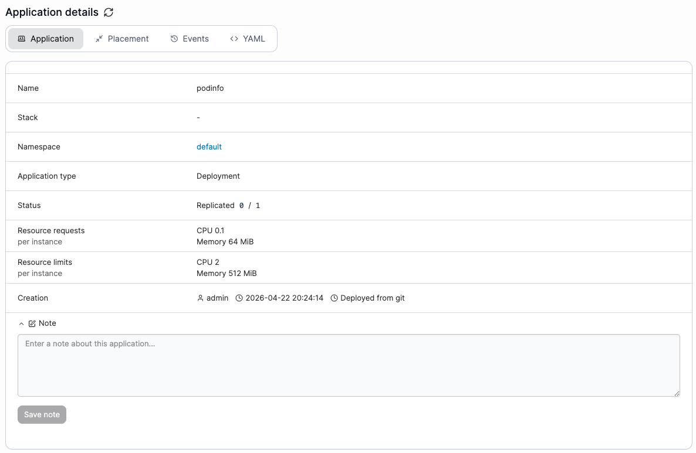
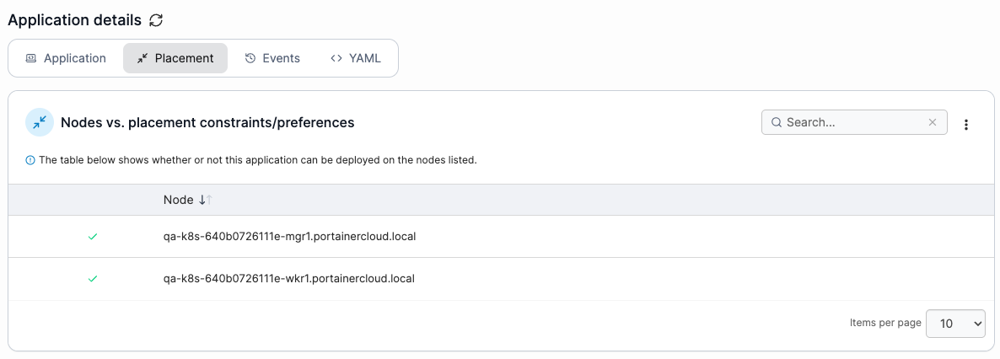
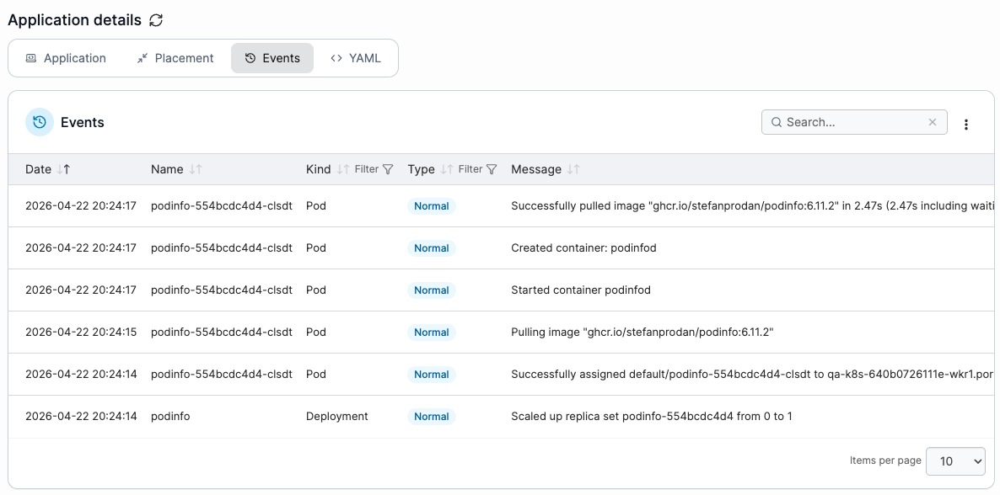
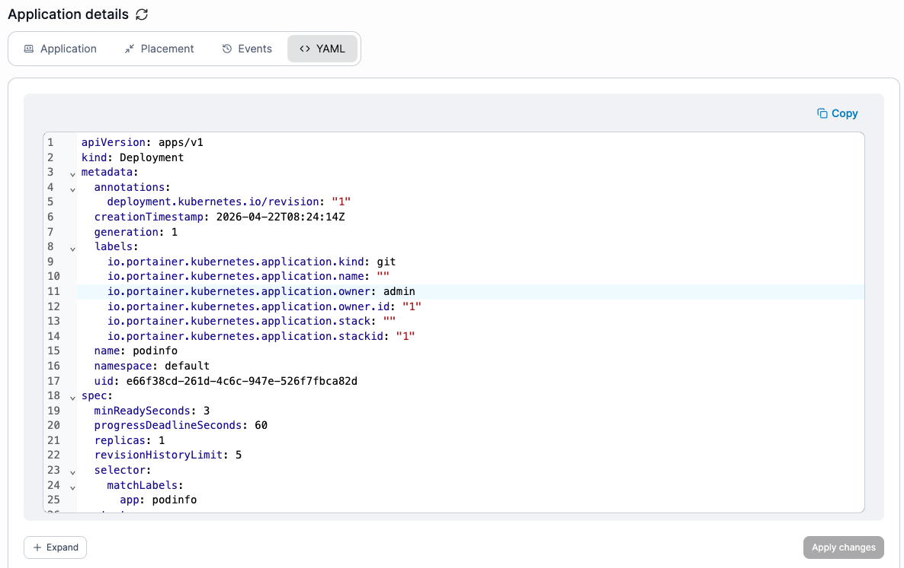
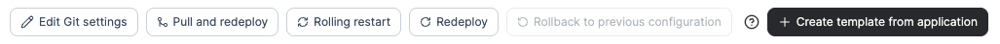
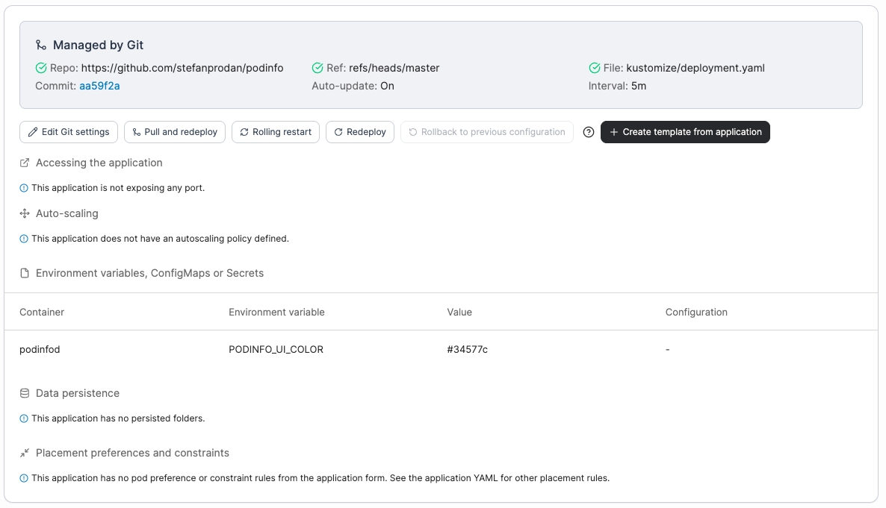
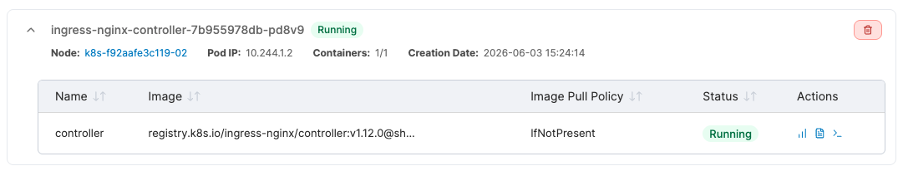

# Inspect an application

To view information about applications running in a cluster, from the menu select **Applications** then select the application you want to inspect.

<figure><figcaption></figcaption></figure>

The **Application details** screen is organized into four sections. The following tables explain all of the information to be found in each.

## Application tab

| Attribute        | Overview                                                                                                                             |
| ---------------- | ------------------------------------------------------------------------------------------------------------------------------------ |
| Name             | The name of the application.                                                                                                         |
| Stack            | The stack that the application belongs to (if any).                                                                                  |
| Namespace        | The namespace that the application is running in.                                                                                    |
| Application Type | The type of application (Pod, Deployment, StatefulSet, DaemonSet, etc).                                                              |
| Status           | Indicates whether or not the application is running. Where applicable, this also shows the replication state and number of replicas. |
| Creation         | Shows when the application was created and by whom, as well as how the application was deployed.                                     |
| Note             | Add a note about the application or edit an existing note.                                                                           |

<figure><figcaption></figcaption></figure>

## Placement tab

Here you'll find information about any placement constraints or preferences that have been defined for the application and how they're being applied.

<figure><figcaption></figcaption></figure>

## Events tab

Shows information about application-related events.

<figure><figcaption></figcaption></figure>

## YAML tab

This displays the YAML generated from the application deployment, and lets you edit the YAML for an application directly. Updates to your manifest made here are applied using the Kubernetes `patch` mechanism.


Editing your YAML through this section is only available in Portainer Business Edition.


<figure><figcaption></figcaption></figure>

Make your edits then click **Apply changes** to update the deployment.


Editing the YAML is not available for resources in namespaces marked as system.


## Actions

Depending on how the application was deployed and your user role, a number of actions can be performed, including:

* [Editing the application](edit.md).
* Edit the [Git settings](manifest/create.md#repository).
* Scale the application (Business Edition only).
* Pull and redeploy.
* Perform a rolling restart of the application (Business Edition only).
* Redeploying the application (terminating all the services and recreating them).
* Rolling the application back to a previous configuration.
* Creating a [template](../templates/) from the application.

<figure><figcaption>
Some of the potential actions that may appear for your application
</figcaption></figure>

### Configuration details

| Configuration                                | Overview                                                                                                                        |
| -------------------------------------------- | ------------------------------------------------------------------------------------------------------------------------------- |
| Git deployment details                       | If your application was deployed from Git, you will see details about the Git deployment within the **Managed by Git** section. |
| Accessing the application                    | Shows which ports (if any) are published from the container.                                                                    |
| Auto-scaling                                 | Indicates the application's auto-scaling policy.                                                                                |
| Environment variables, ConfigMaps or Secrets | A list of any environment variables, ConfigMaps and secrets that have been defined for the application.                         |
| Data persistence                             | A list of the persistent folders and their details.                                                                             |

<figure><figcaption></figcaption></figure>

## Application pods

This section lists the pods running your application. Each pod displays the node it is running on (select to view node details), its IP address, the number of containers, and the creation date. You can delete a pod using the buttons in the top-right corner of its tile. Note that if a pod is configured with the `RestartAllContainers` restart strategy, containers will restart in-place automatically.

Select a pod to expand it and view its containers, including the image in use, the image pull policy, and the current status. From the **Actions** column, you can also access container stats, logs, and the console.

<figure><figcaption></figcaption></figure>
