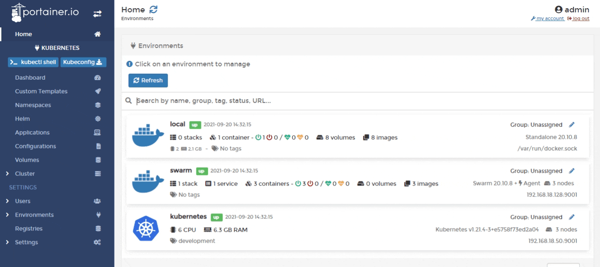
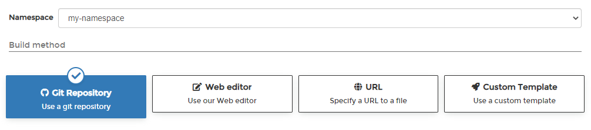
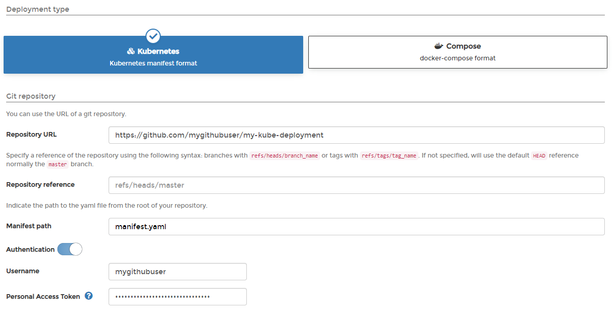

# Add a new application using a manifest

There are two ways to add a new application: [manually by using a form](add.md) or automatically by using a manifest. This article explains how to add an application using a manifest.


Manifests aren't just for applications - you can also deploy namespaces, configurations and volumes using a manifest.


From the menu select **Applications** then click **Create from manifest**.

Select the namespace for your deployment and then choose the build method from the options provided.

## Option 1: Git Repository

From **Deployment type** select either **Kubernetes** or **Compose** \(depending on the format of the manifest\) then enter the details of your Git repo.


Portainer uses Kompose to convert a Compose manifest to a Kubernetes-compliant manifest. Be aware that currently not all Compose format options are supported by Kompose.


| Field/Option | Overview |
| :--- | :--- |
| Repository URL | Enter the URL to your Git repository. |
| Repository reference | Enter the reference to use when pulling from your repository. If this is left blank, Portainer will use the default `HEAD` reference. |
| Manifest path | Enter the path to your manifest file relative to the root of your repository. |
| Authentication | Toggle this on if your repository requires authentication. |
| Username | When using authentication, enter the username for your Git repository. |
| Personal Access Token | When using authentication, enter the personal access token or password for your Git repository. |

When you're ready, click **Deploy**.

## Option 2: Web editor

From **Deployment type** select either **Kubernetes** or **Compose** \(depending on the format of the manifest\) then write or paste in your Kubernetes manifest. 


Portainer uses Kompose to convert a Compose manifest to a Kubernetes-compliant manifest. Be aware that currently not all Compose format options are supported by Kompose.


When you're ready, click **Deploy**.  

## Option 3: URL

From **Deployment type** select either **Kubernetes** or **Compose** \(depending on the format of the manifest\) then enter the **URL** to your manifest file.


Portainer uses Kompose to convert a Compose manifest to a Kubernetes-compliant manifest. Be aware that currently not all Compose format options are supported by Kompose.


When you're ready, click **Deploy**.

## Option 4: Custom template

From the **Template** dropdown, select the custom template to use. As an optional step, you can edit the template before deploying the application. If you have no custom templates you will be given a link to the [Custom Templates](../templates/) section.

When you're ready, click **Deploy**.

