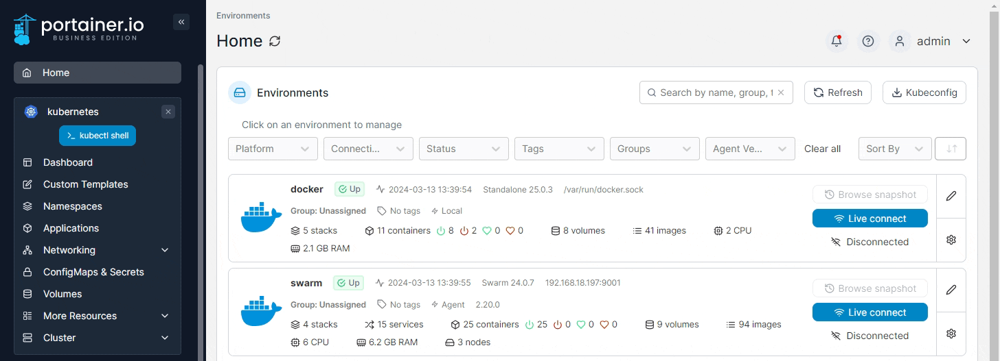
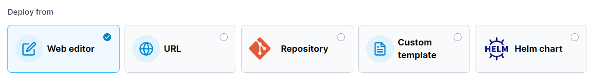
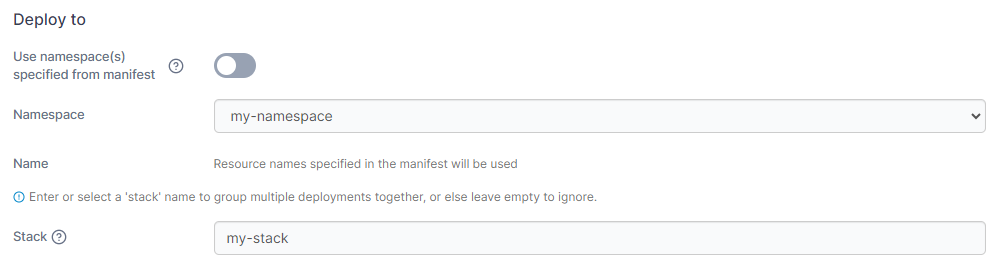
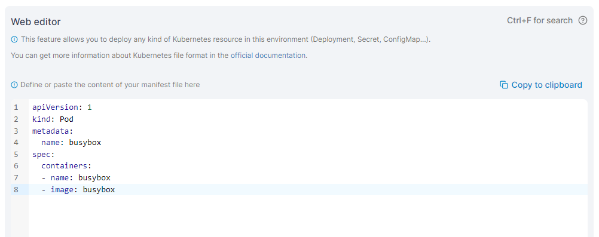
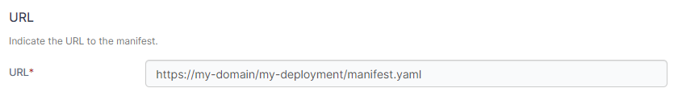
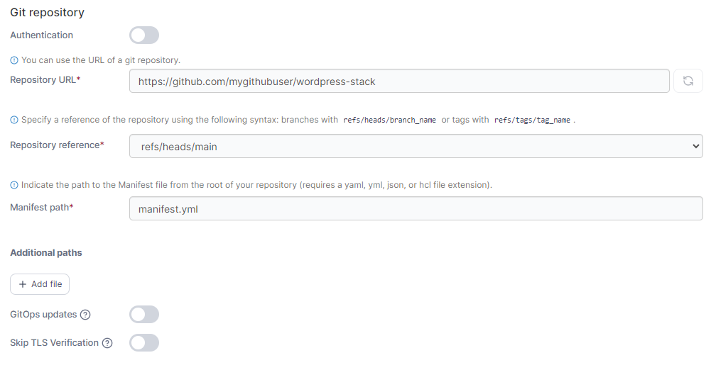
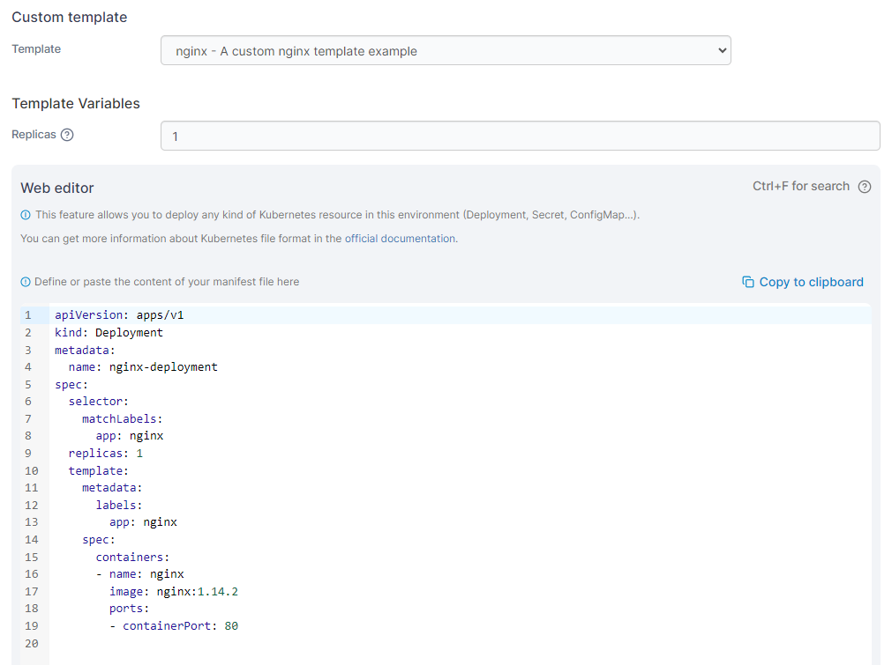
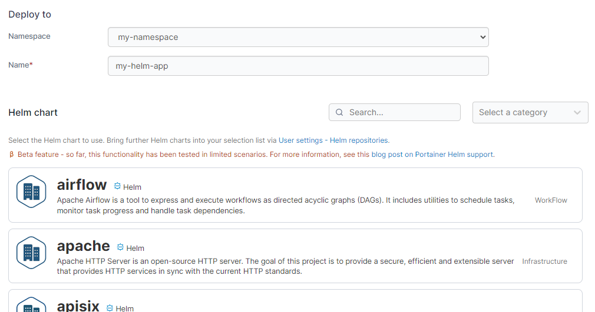
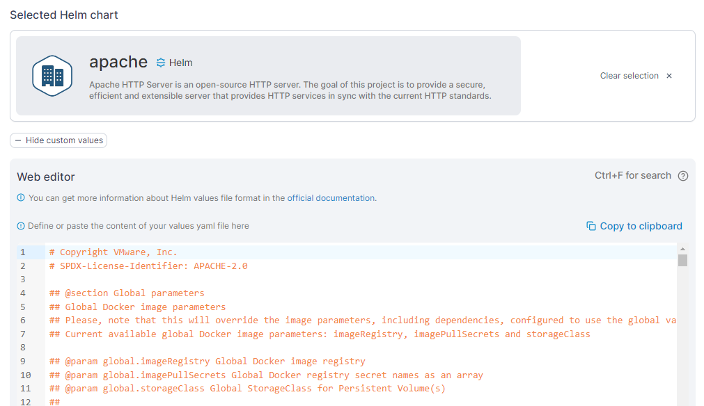

# Add a new application using a manifest

There are two ways to add a new application: [manually by using a form](add.md) or automatically by using a manifest. This article explains how to add an application using a manifest.


Manifests aren't just for applications - you can also deploy namespaces, ingresses, ConfigMaps, secrets, volumes and more using a manifest.


<figure><figcaption></figcaption></figure>

Next, select your deployment method from the **Deploy from** section.

<figure><figcaption></figcaption></figure>

Then, select the namespace to deploy to and optionally provide a stack name for your deployment in the **Deploy to** section.


If you want to use namespaces defined in your manifest defines the namespace(s) you wish to deploy to, you can leave **Namespace** set to `default` and toggle on the **Use namespace(s) specified from manifest** option. This option is not available for deployments from Helm charts.


<figure><figcaption></figcaption></figure>

Your next options will depend on the deployment method you selected.

## Web editor

Use the Web editor to write or paste in your Kubernetes manifest.&#x20;

<figure><figcaption></figcaption></figure>


You can search within the web editor at any time by pressing `Ctrl-F` (or `Cmd-F` on Mac).


When you're ready, click **Deploy**. &#x20;

## URL

Enter the **URL** to your manifest file in the provided field.

<figure><figcaption></figcaption></figure>

When you're ready, click **Deploy**.

## Repository

Use the provided fields to enter the details of your Git repository containing your Kubernetes manifests.


When an application is deployed from Git, Portainer will clone the entire Git repository as part of the deployment process. Ensure you have enough free space to accommodate this.



Portainer's Git deployment functionality does not currently support the use of Git submodules. If your repository includes submodules, they will not be pulled as part of the deployment. We [hope to add support](https://github.com/orgs/portainer/discussions/9767) for submodules in a future release.


| Field/Option          | Overview                                                                                                                                                                  |
| --------------------- | ------------------------------------------------------------------------------------------------------------------------------------------------------------------------- |
| Authentication        | Toggle this on if your repository requires authentication.                                                                                                                |
| Git Credentials       | If the **Authentication** toggle is enabled and you have [configured Git credentials](../../account-settings.md#git-credentials), you can select them from this dropdown. |
| Username              | Enter your Git username.                                                                                                                                                  |
| Personal Access Token | Enter your personal access token or password.                                                                                                                             |
| Save credential       | Check this option to save the credentials entered above for future use under the name provided in the **credential name** field.                                          |

<figure><figcaption></figcaption></figure>

| Field/Option          | Overview                                                                                                                                                                                          |
| --------------------- | ------------------------------------------------------------------------------------------------------------------------------------------------------------------------------------------------- |
| Repository URL        | Enter the repository URL. If you have enabled Authentication above the credentials will be used to access the repository. The below options will be populated by what is found in the repository. |
| Repository reference  | Select the reference to use when deploying the stack (for example, the branch).                                                                                                                   |
| Manifest path         | Enter the path to your manifest file relative to the root of your repository.                                                                                                                     |
| Additional paths      | Click **Add file** to define additional manifests or compose files to process as part of the deployment.                                                                                          |
| GitOps updates        | Toggle this on to enable GitOps updates (see below).                                                                                                                                              |
| Skip TLS Verification | Toggle this on to skip the verification of TLS certificates used by your repository. This is useful if your repo uses a self-signed certificate.                                                  |

<figure><figcaption></figcaption></figure>

### GitOps updates

Enabling GitOps updates gives Portainer the ability to update your application automatically, either by polling the repository at a defined interval for changes or by using a webhook to trigger an update.


For more detail on how GitOps updates function under the hood, have a look at [this knowledge base article](https://portal.portainer.io/knowledge/how-do-automatic-updates-for-stacks-applications-work).



If your application is configured for GitOps updates and you make changes locally, these changes will be overridden by the application definition in the Git repository. Bear this in mind when making configuration changes.


| Field/Option   | Overview                                                                                                                                                                                                                                                    |
| -------------- | ----------------------------------------------------------------------------------------------------------------------------------------------------------------------------------------------------------------------------------------------------------- |
| Mechanism      | Choose from **Polling** or **Webhook**.                                                                                                                                                                                                                     |
| Fetch interval | When using the **Polling** method, choose how often you wish to check the Git repository for updates to your application.                                                                                                                                   |
| Webhook        | 
When using the <strong>Webhook</strong> method, this displays the webhook URL to use. Click <strong>Copy link</strong> to copy the webhook to your clipboard. For more on webhooks, refer to the <a href="webhooks.md">webhook documentation</a>.
 |

<figure><figcaption>
GitOps updates using the polling mechanism
</figcaption></figure>

<figure><figcaption>
GitOps updates using the webhook mechanism
</figcaption></figure>

| Field/Option          | Overview                                                                                                                                                                                                                                                                                                                                                                                                                                                                                                                                                                                                   |
| --------------------- | ---------------------------------------------------------------------------------------------------------------------------------------------------------------------------------------------------------------------------------------------------------------------------------------------------------------------------------------------------------------------------------------------------------------------------------------------------------------------------------------------------------------------------------------------------------------------------------------------------------- |
| Always apply manifest | 
Enable this setting to force the redeployment of your application (kubectl apply) at the specified interval (or when the webhook is triggered), overwriting any changes that have been made in the local environment, even if there has been no update to the application in Git. This is useful if you want to ensure that your Git repository is the source of truth for your applications and are happy with the local application being replaced.

If this option is left disabled, automatic updates will only trigger if Portainer detects a change in the remote Git repository.
 |

<figure><figcaption></figcaption></figure>

When you're ready, click **Deploy**.

## Custom template

From the **Template** dropdown, select the custom template to use. Depending on the template, you may need (or be able) to set template variables that will adjust the deployment configuration. As an optional step, you can edit the template before deploying the application. If you have no custom templates you will be given a link to the [Custom Templates](../templates/) section.

<figure><figcaption></figcaption></figure>

When you're ready, click **Deploy**.

## Helm chart

Once you have selected a namespace for your Helm deployment you will need to specify a **Name** for your deployment. Then select a chart to use from the list provided. You can search within the list and filter by category.

<figure><figcaption></figcaption></figure>

Once you have selected a chart, Portainer will import the `values.yaml` file for the chart so you can configure any parameters required for the application. You can click the **Show custom values** option to expand the Web editor to make any changes.

<figure><figcaption></figcaption></figure>

When you're ready, click **Install**.
