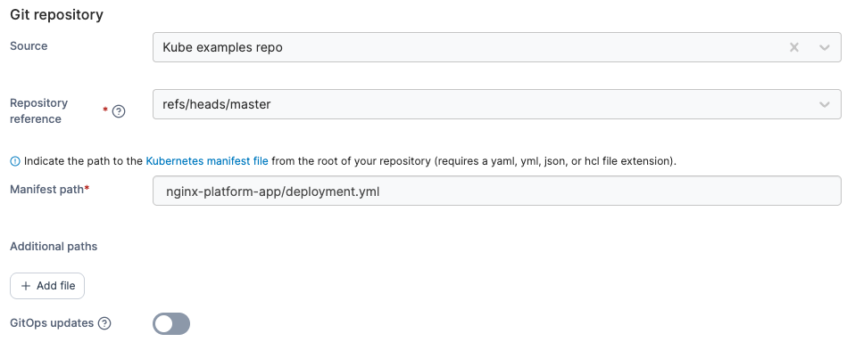

# Create an application from a Manifest

When creating an application from a Manifest, first select your deployment method in the **Deploy from** section.

<figure><figcaption></figcaption></figure>

Then, select the **Namespace** to deploy to and optionally provide a **Name** for your deployment in the **Deploy to** section.


If you want to use namespaces defined in your manifest, you can leave **Namespace** set to `default` and toggle on the **Use namespace(s) specified from manifest** option.


Your next options will depend on the deployment method you selected.

## Repository

Use the provided fields to enter the details of your Git repository containing your Kubernetes manifests.

| Field/Option         | Overview                                                                                                 |
| -------------------- | -------------------------------------------------------------------------------------------------------- |
| Source               | Select your Git repository from your list of preconfigured [sources](../../../app-delivery/sources/).    |
| Repository reference | Select the reference to use when deploying the stack (for example, the branch).                          |
| Manifest path        | Enter the path to your manifest file relative to the root of your repository.                            |
| Additional paths     | Click **Add file** to define additional manifests or compose files to process as part of the deployment. |
| GitOps updates       | Toggle this on to enable GitOps updates (see below).                                                     |

<figure><figcaption></figcaption></figure>

### GitOps updates

Enabling GitOps updates gives Portainer the ability to update your application automatically, either by polling the repository at a defined interval for changes or by using a webhook to trigger an update.


If your application is configured for GitOps updates and you make changes locally, these changes will be overridden by the application definition in the Git repository. Bear this in mind when making configuration changes.


| Field/Option   | Overview                                                                                                                                                                                                                                                       |
| -------------- | -------------------------------------------------------------------------------------------------------------------------------------------------------------------------------------------------------------------------------------------------------------- |
| Mechanism      | Choose from **Polling** or **Webhook**.                                                                                                                                                                                                                        |
| Fetch interval | When using the **Polling** method, choose how often you wish to check the Git repository for updates to your application.                                                                                                                                      |
| Webhook        | 
When using the <strong>Webhook</strong> method, this displays the webhook URL to use. Click <strong>Copy link</strong> to copy the webhook to your clipboard. For more on webhooks, refer to the <a href="../webhooks.md">webhook documentation</a>.
 |

<figure><figcaption>
GitOps updates using the polling mechanism
</figcaption></figure>

<figure><figcaption>
GitOps updates using the webhook mechanism
</figcaption></figure>

| Field/Option          | Overview                                                                                                                                                                                                                                                                                                                                                                                                                                                                                                                                                                                            |
| --------------------- | --------------------------------------------------------------------------------------------------------------------------------------------------------------------------------------------------------------------------------------------------------------------------------------------------------------------------------------------------------------------------------------------------------------------------------------------------------------------------------------------------------------------------------------------------------------------------------------------------- |
| Always apply manifest | 
Enable this setting to force the redeployment of your application (kubectl apply) at the specified interval (or when the webhook is triggered), overwriting any changes that have been made in the local environment, even if there has been no update to the application in Git. This is useful if you want to ensure that your Git repository is the source of truth for your applications and are happy with the local application being replaced.

If this option is left disabled, automatic updates will only trigger if Portainer detects a change in the remote Git repository.
 |

<figure><figcaption></figcaption></figure>

When you're ready, click **Deploy**.

## Web editor

Use the Web editor to write or paste in your Kubernetes manifest.

<figure><figcaption></figcaption></figure>


You can search within the web editor at any time by pressing `Ctrl-F` (or `Cmd-F` on Mac).


When you're ready, click **Deploy**.

## URL

Enter the **URL** to your manifest file in the provided field.

<figure><figcaption></figcaption></figure>

When you're ready, click **Deploy**.

## Custom template

From the **Template** dropdown, select the custom template to use. Depending on the template, you may need (or be able) to set template variables that will adjust the deployment configuration. As an optional step, you can edit the template before deploying the application. If you have no custom templates you will be given a link to the [Custom Templates](../../templates/) section.

<figure><figcaption></figcaption></figure>

When you're ready, click **Deploy**.
