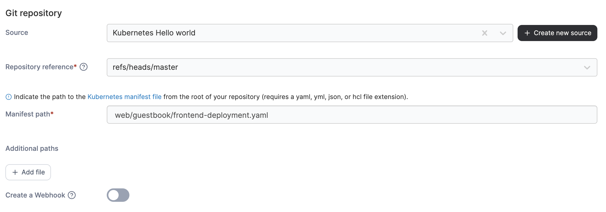
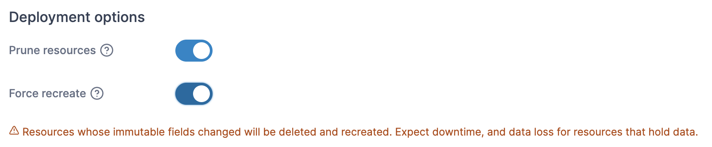

# Create an application from a Manifest

When creating an application from a Manifest, first select your deployment method in the **Deploy from** section.

<figure><figcaption></figcaption></figure>

Then, select the **Namespace** to deploy to and optionally provide a **Name** for your deployment in the **Deploy to** section. If you wish to group your stacks, specify a **Stack** name to label the resource.


If you want to use namespaces defined in your manifest, you can leave **Namespace** set to `default` and toggle on the **Use namespace(s) specified from manifest** option.


Your next options will depend on the deployment method you selected.

## Repository

Use the provided fields to enter the details of your Git repository containing your Kubernetes manifests.

| Field/Option         | Overview                                                                                                                                                                                                                                                                                                                                                                                        |
| -------------------- | ----------------------------------------------------------------------------------------------------------------------------------------------------------------------------------------------------------------------------------------------------------------------------------------------------------------------------------------------------------------------------------------------- |
| Source               | Select your Git repository from your list of preconfigured [sources](../../../app-delivery/sources/). Select **Create new source** to navigate to the [source creation view](../../../app-delivery/sources/add-a-new-git-repository-source.md).                                                                                                                                                 |
| Repository reference | Select the reference to use when deploying the stack (for example, the branch).                                                                                                                                                                                                                                                                                                                 |
| Manifest path        | Enter the path to your manifest file relative to the root of your repository.                                                                                                                                                                                                                                                                                                                   |
| Additional paths     | Click **Add file** to define additional manifests or compose files to process as part of the deployment.                                                                                                                                                                                                                                                                                        |
| Create a Webhook     | 
When enabled, the webhook URL to use is displayed. Click <strong>Copy link</strong> to copy the webhook to your clipboard. For more on webhooks, refer to the <a href="../webhooks.md">webhook documentation</a>.
                                                                                                                                                                     |
| Force redeployment   | 
When enabled, when redeploy is triggered via the webhook, <code>kubectl apply</code> is always performed, even if Portainer detects no difference between the git repo and what was stored locally on the last git pull.

This is useful if you want your git repo to be the source of truth and are fine with changes made directly to resources in the cluster being overwritten.
 |

<figure><figcaption></figcaption></figure>

## Web editor

Use the Web editor to write or paste in your Kubernetes manifest.

<figure><figcaption></figcaption></figure>


You can search within the web editor at any time by pressing `Ctrl-F` (or `Cmd-F` on Mac).


## URL

Enter the **URL** to your manifest file in the provided field.

<figure><figcaption></figcaption></figure>

## Custom template

From the **Template** dropdown, select the custom template to use. Depending on the template, you may need (or be able) to set template variables that will adjust the deployment configuration. As an optional step, you can edit the template before deploying the application. If you have no custom templates you will be given a link to the [Custom Templates](../../templates/) section.

<figure><figcaption></figcaption></figure>

## Additional fields

### Deployment options

| Field/Option    | Overview                                                                                                                                                                                                                                   |
| --------------- | ------------------------------------------------------------------------------------------------------------------------------------------------------------------------------------------------------------------------------------------ |
| Prune resources | When enabled, updating this artifact will also delete the resources it previously created that the manifest no longer declares. Turning this off leaves those resources running on the cluster with nothing in Portainer pointing at them. |
| Force recreate  | For fields that cannot be changed after a resource is created, enable force recreate to let Portainer delete and recreate resources instead of failing the deployment.                                                                     |

<figure><figcaption></figcaption></figure>

When you're ready, click **Deploy**.
