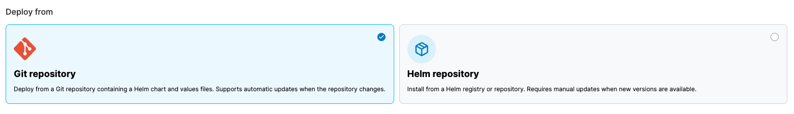
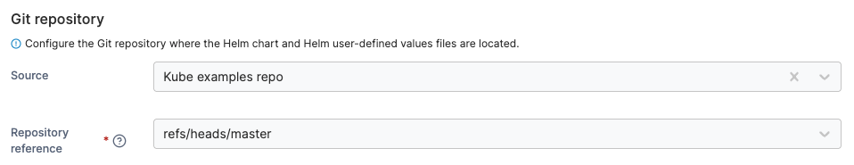
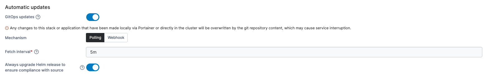
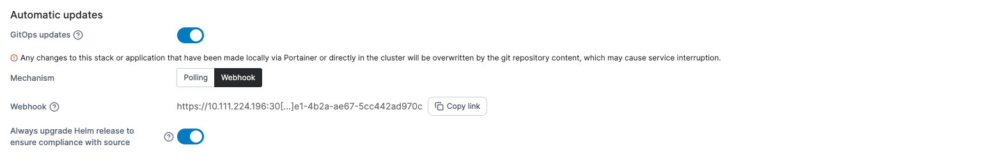
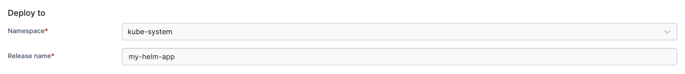
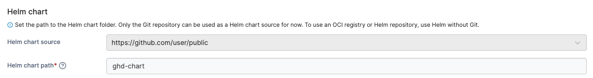
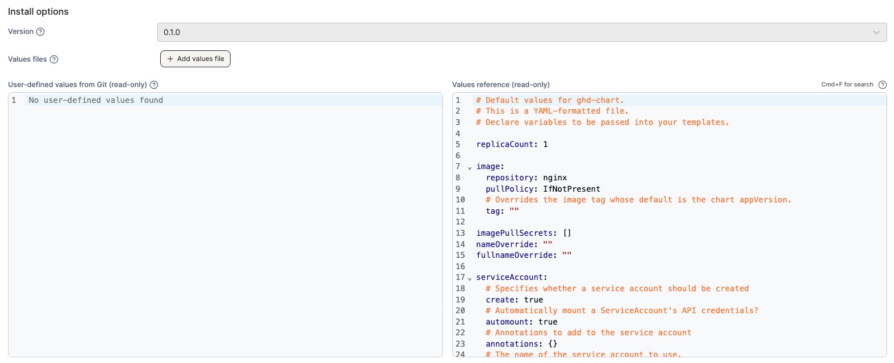
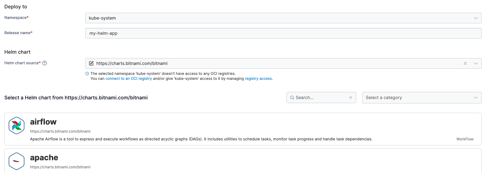

# Create an application from a Helm chart

When creating an application from a Helm chart, you can deploy it from either a **Git repository** or a **Helm repository**. First, select your deployment method in the **Deploy from** section.

<figure><figcaption></figcaption></figure>

## Git repository


This feature is only available in [Portainer Business Edition](https://www.portainer.io/business-upsell?from=ca-file).


Use the provided fields to enter the details of your Git repository containing your Helm chart and values files.

| Field/Option         | Overview                                                                                               |
| -------------------- | ------------------------------------------------------------------------------------------------------ |
| Source               | Select your Git repository from your list of preconfigured [sources](../../../app-delivery/sources/).  |
| Repository reference | Select the reference to use when deploying the stack (for example, the branch).                        |

<figure><figcaption></figcaption></figure>

#### Automatic updates

Enabling **GitOps updates** gives Portainer the ability to update your application automatically, either by polling the repository at a defined interval for changes or by using a webhook to trigger an update.


If your application is configured for GitOps updates and you make changes locally, these changes will be overridden by the application definition in the Git repository. Bear this in mind when making configuration changes.


| Field/Option                                                 | Overview                                                                                                                                                                                                                                                                                                                                                                                               |
| ------------------------------------------------------------ | ------------------------------------------------------------------------------------------------------------------------------------------------------------------------------------------------------------------------------------------------------------------------------------------------------------------------------------------------------------------------------------------------------ |
| Mechanism                                                    | Choose from **Polling** or **Webhook**.                                                                                                                                                                                                                                                                                                                                                                |
| Fetch interval                                               | When using the **Polling** method, choose how often you wish to check the Git repository for updates to your application.                                                                                                                                                                                                                                                                              |
| Webhook                                                      | 
When using the <strong>Webhook</strong> method, this displays the webhook URL to use. Click <strong>Copy link</strong> to copy the webhook to your clipboard. For more on webhooks, refer to the <a href="../webhooks.md">webhook documentation</a>.
                                                                                                                                         |
| Always upgrade Helm release to ensure compliance with source | 
Enable this setting to ensure a Helm upgrade is always performed when a redeploy is triggered via a webhook or polling, even if Portainer detects no changes between the Git repository and the last local pull.

This is useful if you treat your Git repository as the source of truth and are comfortable with any changes made directly to resources in the cluster being overwritten.
 |

<figure><figcaption>
GitOps updates using the polling mechanism
</figcaption></figure>

<figure><figcaption>
GitOps updates using the webhook mechanism
</figcaption></figure>

### Deploy to

Once you have selected a **Namespace** for your Helm deployment you will need to specify a **Release name** for your deployment.

<figure><figcaption></figcaption></figure>

### Helm chart

From the dropdown, select the **Helm chart source** you want to pull from, and enter the **Helm chart path**. The path must point to a folder that includes a `Chart.yaml` file.

<figure><figcaption></figcaption></figure>

### Install options

Under **Install options**, you can view the **Version** of the Helm chart as defined in the `Chart.yaml` file from the specified Helm chart path. This field is read-only and cannot be changed.

You can also specify one or more **Values files** to override the default chart values. If multiple files are provided, they are merged in the order listed, with the last file taking precedence.


You can get more information about the Helm values file format in the [official Helm documentation](https://helm.sh/docs/chart_template_guide/values_files/).


**User-defined values from Git** and **Values reference** are displayed side by side, showing the values that will be applied during the creation of the application. These views are read-only.

<figure><figcaption></figcaption></figure>

When you're ready, click **Deploy**.

## Helm repository

Once you have selected a **Namespace** for your Helm deployment, specify a **Release name** for your deployment.

Next, choose a **Helm chart source** from the dropdown. Portainer will pull the available chart list from the selected registry and display them below. Select a chart to use from the list. You can search within the list or filter by category.


Business Edition users will be able to choose charts from OCI registries if they have been [configured](../../../../admin/registries/) and [given access to the selected namespace](../../cluster/registries.md#managing-access).



When a Helm chart source is chosen for the first time, it may take some time to download and populate the charts in the list.


<figure><figcaption></figcaption></figure>

Once you have selected a chart, Portainer will import the `values.yaml` file for the latest version of the chart and display it in the right hand pane as a reference. You can make any necessary customizations to the `values.yaml` file in the left-hand pane. You can also choose to deploy a different version of the chart by choosing the version from the **Version** dropdown. To view a preview of the manifest you will create when you deploy the Helm chart, click the **Manifest preview** heading.

Once you've made your customizations, click **Install** to begin the deployment.

<figure><figcaption></figcaption></figure>
