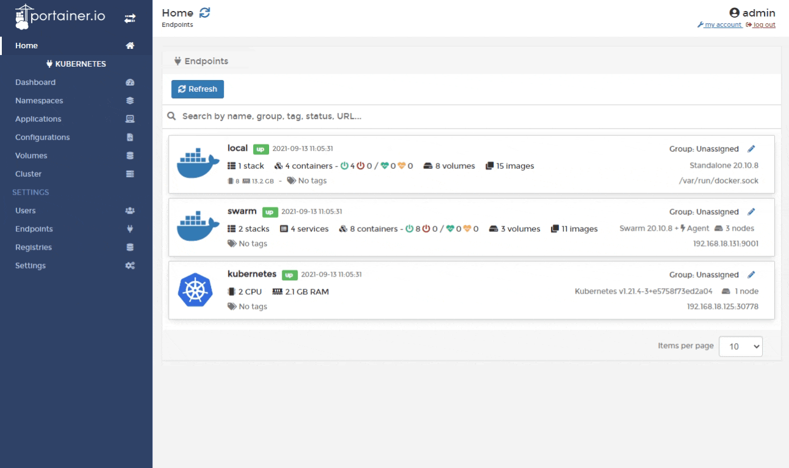
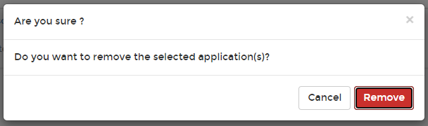

# Remove an application

From the menu select **Applications**, tick the checkbox next to the application you want to remove then click **Remove**.

When the confirmation message appears, click **Remove**.

