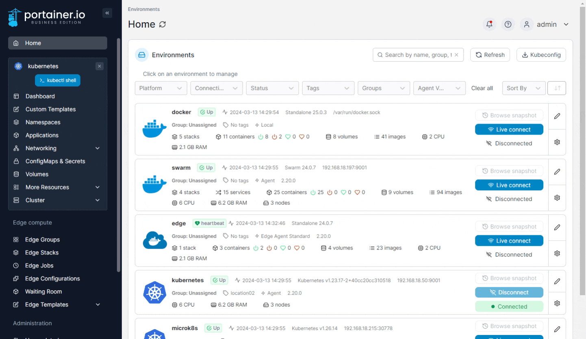
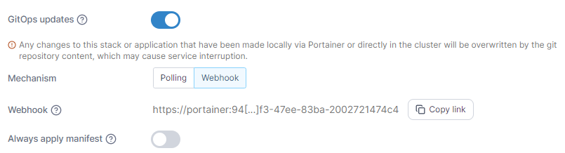

# Webhooks

A webhook is a POST request sent to a URL. Use webhooks to trigger an action in response to an event such as a repository push.


This functionality is only available in [Portainer Business Edition](https://www.portainer.io/business-upsell?from=stack-webhook).



Webhooks are only available on non-Edge environments (environments running Portainer Server or Portainer Agent, not the Portainer Edge Agent). This is because the tunnel to the Portainer Edge Agent is only opened on-demand, and therefore would mean there is no way to expose a webhook permanently.


## Enabling an application webhook

From the menu select **Applications** then select the application that you want to configure the webhook for. Then select the **Edit this application** button.


Webhooks are only available for applications deployed from a Git repository.


<figure><figcaption></figcaption></figure>

Enable **GitOps updates** if it is not already enabled and select `Webhook` as the **Mechanism**. When the URL appears, click **Copy link**. This is the URL used to trigger the webhook.

<figure><figcaption></figcaption></figure>

This example shows how to trigger the webhook:

```
<form action="https://portainer:9443/api/stacks/webhooks/40ac1662-47c3-4a8e-b148-2a34eb52bb42" method="post">
  Redeploy application <input type="submit" />
</form>
```

## Using environment variables with webhooks

When triggering a webhook, environment variables can be passed through the endpoint and referenced within the deployment.


Environment variables can not be updated for Pods, only for Deployments.


To specify an environment variable on a webhook, add it as a variable to the URL. For example, to pass a `SERVICE_TAG` variable with the value `development`:

```
https://portainer:9443/api/stacks/webhooks/40ac1662-47c3-4a8e-b148-2a34eb52bb42?SERVICE_TAG=development
```

To reference the `SERVICE_TAG` variable in your manifest with a fallback to the value `stable`:

```
apiVersion: apps/v1
kind: Deployment
metadata:
  name: nginx-deployment
spec:
  selector:
    matchLabels:
      app: nginx
  replicas: 2
  template:
    metadata:
      labels:
        app: nginx
    spec:
      containers:
      - name: nginx
        image: nginx:1.14.2
        ports:
        - containerPort: 80
        env:
        - name: SERVICE_TAG 
          value: "stable"
```


Environment variables must already be defined in the manifest - new environment variables cannot be added via the webhook.


## Rolling restarts

When using an application's webhook to redeploy your application, you can tell Portainer to perform a rolling restart of the application rather than a "terminate and restart" redeploy.


This functionality is only available in Portainer Business Edition.


To specify this, use the `rollout-restart` parameter in your webhook call:

```
https://portainer:9443/api/stacks/webhooks/40ac1662-47c3-4a8e-b148-2a34eb52bb42?rollout-restart=all
```

&#x20;Valid options are as below:

| Option                                                          | Overview                                                                                                                                                                                                                                                                                                                                                                    |
| --------------------------------------------------------------- | --------------------------------------------------------------------------------------------------------------------------------------------------------------------------------------------------------------------------------------------------------------------------------------------------------------------------------------------------------------------------- |
| `rollout-restart=all`                                           | All of the application's deployments will be redeployed as a rolling restart.                                                                                                                                                                                                                                                                                               |
| `rollout-restart=deployment/deployment1,deployment/deployment2` | <p>Only the specified deployment(s) will be redeployed as a rolling restart. All other deployments will not be redeployed or restarted. Separate multiple deployments with commas.<br>This option supports Deployments (<code>deployment/deployment1</code>), DaemonSets (<code>daemonset/daemonset1</code>), and StatefulSets (<code>statefulset/statefulset1</code>).</p> |

If the `rollout-restart` parameter is not defined, the webhook will redeploy the application in traditional "terminate and restart" behavior.


If your cluster has a [change window](../cluster/setup.md#change-window-settings) enabled, the rolling restart will only be performed within the change window.

