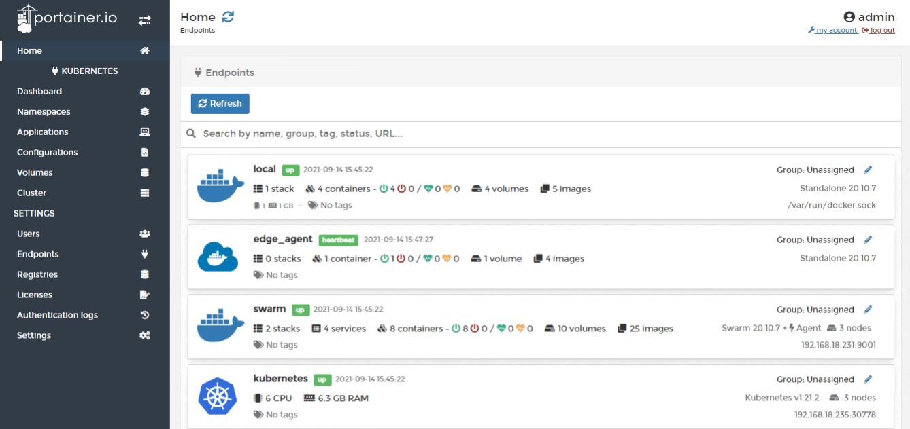

# Cluster

A cluster is a collection of nodes that runs containerized workloads. Portainer lets you keep track of your cluster and its individual nodes, including resource usage and configuration.

From the menu select **Cluster**. 

The following information is provided in the first screen:

| Attribute | Overview |
| :--- | :--- |
| Memory reservation | This is the amount of memory used by and available to the cluster. |
| CPU reservation | This is the amount of reserved CPU that has been used. |
| Cluster status | Displays the status of each component of the cluster. |

You can also inspect individual nodes of your cluster.



If you need to adjust elements of your Kubernetes configuration you can do so here as well.



