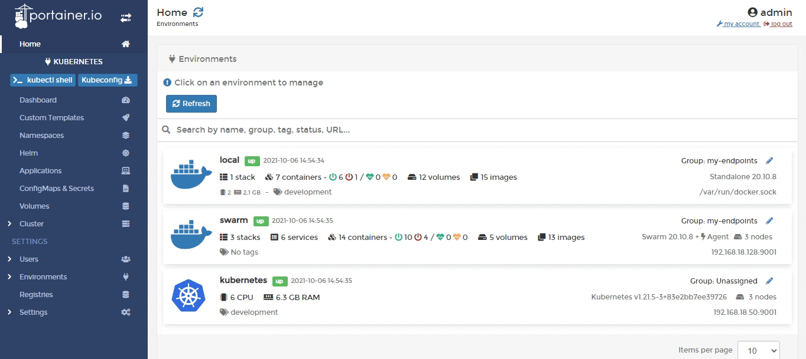

# Cluster

A cluster is a collection of nodes that runs containerized workloads. Portainer lets you keep track of your cluster and its individual nodes, including resource usage and configuration.

From the menu select **Cluster**. 

The following information is provided in the first screen:

| **Attribute**      | **Overview**                                             |
| ------------------ | -------------------------------------------------------- |
| Memory reservation | The amount of memory available to the cluster.           |
| Memory used        | The amount of memory used by the cluster.                |
| CPU reservation    | The amount of CPU that has been reserved in the cluster. |
| CPU used           | The amount of CPU used by the cluster.                   |

You can also inspect individual nodes of your cluster.


[node.md](node.md)


If you need to adjust elements of your Kubernetes configuration you can do so here as well.


[setup.md](setup.md)


