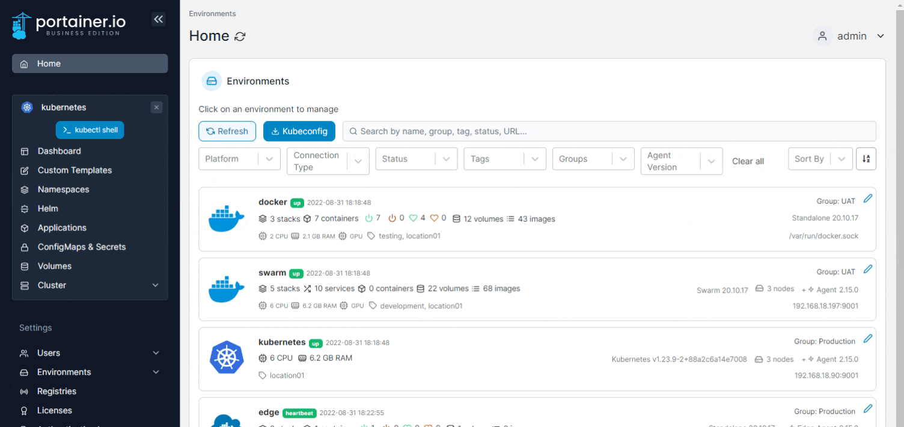
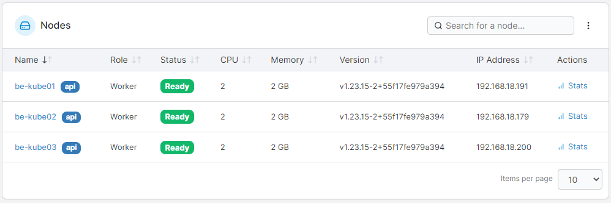

# Cluster

A cluster is a collection of nodes that runs containerized workloads. Portainer lets you keep track of your cluster and its individual nodes, including resource usage and configuration.

From the menu select **Cluster**.&#x20;

<figure><figcaption></figcaption></figure>

The following information is provided:

| Attribute          | Overview                                                                                                                                                    |
| ------------------ | ----------------------------------------------------------------------------------------------------------------------------------------------------------- |
| Memory reservation | The amount of memory available to the cluster.                                                                                                              |
| Memory used        | The amount of memory used by the cluster. This is only visible if you have [enabled using the metrics API](setup.md#enable-features-using-the-metrics-api). |
| CPU reservation    | The amount of CPU that has been reserved in the cluster.                                                                                                    |
| CPU used           | The amount of CPU used by the cluster. This is only visible if you have [enabled using the metrics API](setup.md#enable-features-using-the-metrics-api).    |
| Leader status      | This section lists components and their leader node in your cluster.                                                                                        |

<figure><figcaption></figcaption></figure>

## Nodes

This section lists the nodes in your cluster with information about each node. To view [details of a specific node](node.md), click the name of the node in the list.&#x20;

<figure><figcaption></figcaption></figure>

To view usage stats for a node, click the **Stats** link to the right of the node.


Node stats are only available when you have [enabled using the metrics API](setup.md#enable-features-using-the-metrics-api).


<figure><figcaption></figcaption></figure>

If you need to adjust elements of your Kubernetes configuration you can do so here as well.


[setup.md](setup.md)


If you would like to define security constraints on the pods in your environment, select **Security constraints**.


[security.md](security.md)


