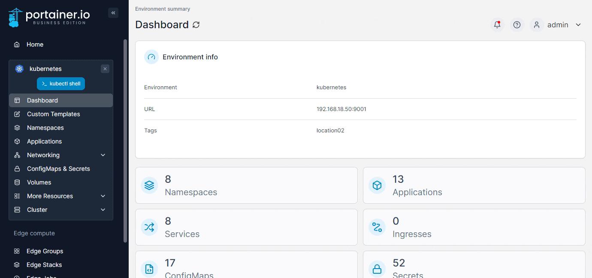
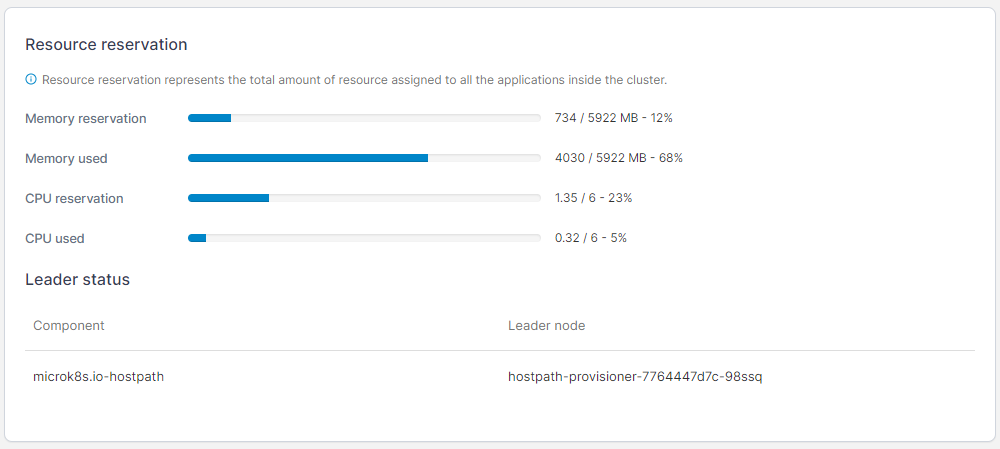
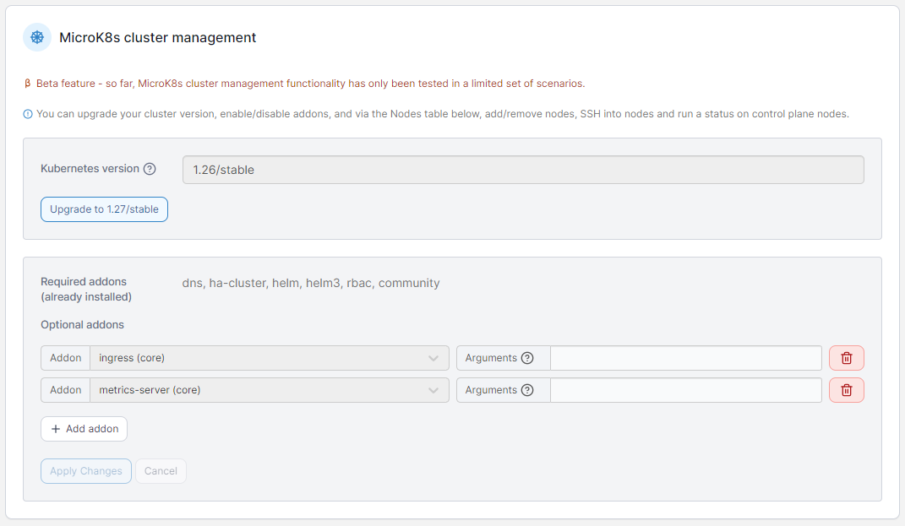
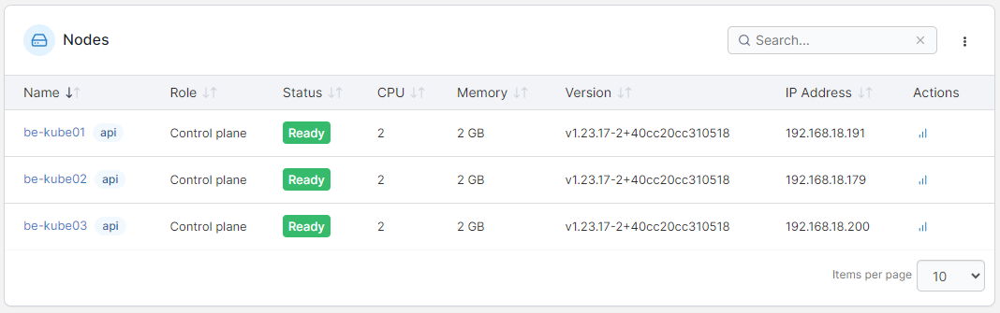
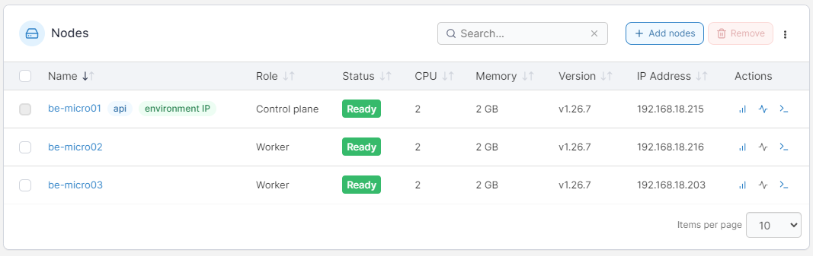

# Details

A cluster is a collection of nodes that runs containerized workloads. Portainer lets you keep track of your cluster and its individual nodes, including resource usage and configuration.

From the menu expand the **Cluster** section and select **Details**.&#x20;

<figure><figcaption></figcaption></figure>

The following information is provided:

| Attribute          | Overview                                                                                                                                                    |
| ------------------ | ----------------------------------------------------------------------------------------------------------------------------------------------------------- |
| Memory reservation | The amount of memory available to the cluster.                                                                                                              |
| Memory used        | The amount of memory used by the cluster. This is only visible if you have [enabled using the metrics API](setup.md#enable-features-using-the-metrics-api). |
| CPU reservation    | The amount of CPU that has been reserved in the cluster.                                                                                                    |
| CPU used           | The amount of CPU used by the cluster. This is only visible if you have [enabled using the metrics API](setup.md#enable-features-using-the-metrics-api).    |
| Leader status      | This section lists components and their leader node in your cluster.                                                                                        |

<figure><figcaption></figcaption></figure>

## MicroK8s cluster management


This section only appears when the environment was provisioned via the [Create a Kubernetes cluster](../../../admin/environments/add/kube-create/microk8s.md) functionality.


In this section you can see and make changes to the configuration of your MicroK8s cluster provisioned by Portainer.


This functionality is in beta and only tested with some configurations. Refer to our [known issues knowledge base article](https://portal.portainer.io/knowledge/microk8s-known-issues) for caveats when using this feature.


| Field/Option                        | Overview                                                                                                                                                                                                                                                                                                                    |
| ----------------------------------- | --------------------------------------------------------------------------------------------------------------------------------------------------------------------------------------------------------------------------------------------------------------------------------------------------------------------------- |
| Kubernetes version                  | 
Displays the version of Kubernetes that is running on your cluster. If a newer version of Kubernetes is available, you can click the <strong>Upgrade</strong> button to upgrade your cluster to the version specified. Note that upgrading may cause your cluster to be unavailable while the upgrade processes. 
 |
| Required addons (already installed) | Displays a list of the already installed required addons for your cluster.                                                                                                                                                                                                                                                  |
| Optional addons                     | Displays the optional addons (if any) that are installed on your cluster, as well as any arguments that were used in their configuration. You can adjust the arguments for the addons here, click the **Add addon** button to add additional addons, or click the trash can icon next to an addon to remove it.             |

<figure><figcaption></figcaption></figure>

Click the **Apply Changes** button to apply any adjustments you have made to addon configurations, or **Cancel** to revert your changes.

## Nodes

This section lists the nodes in your cluster with information about each node. To view [details of a specific node](node.md), click the name of the node in the list.&#x20;

<figure><figcaption></figcaption></figure>

To view usage stats for a node, click the stats icon to the right of the node.


Node stats are only available when you have [enabled using the metrics API](setup.md#enable-features-using-the-metrics-api).


<figure><figcaption></figcaption></figure>

On MicroK8s environments provisioned with the [Create a Kubernetes cluster](../../../admin/environments/add/kube-create/microk8s.md) feature, you will also see buttons to add and remove nodes as well as additional action icons to view the MicroK8s status (for control plane nodes) and to connect to the environment via SSH console.

<figure><figcaption></figcaption></figure>

If you need to adjust elements of your Kubernetes configuration you can do so by selecting **Setup** in the left menu.


[setup.md](setup.md)


If you would like to define security constraints on the pods in your environment, select **Security constraints**.


[security.md](security.md)


