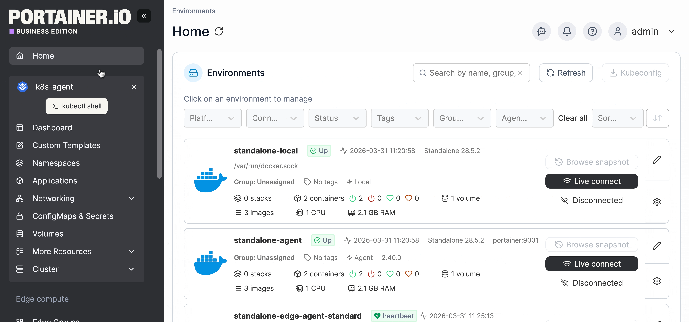
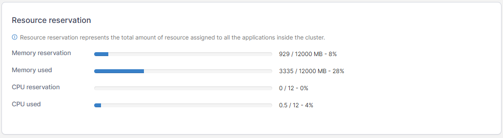
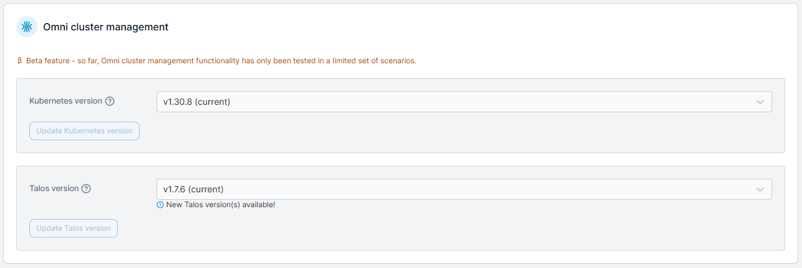
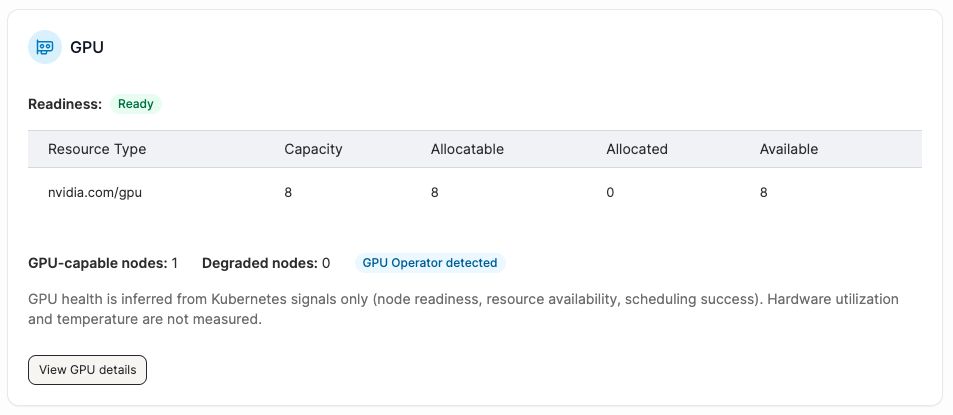
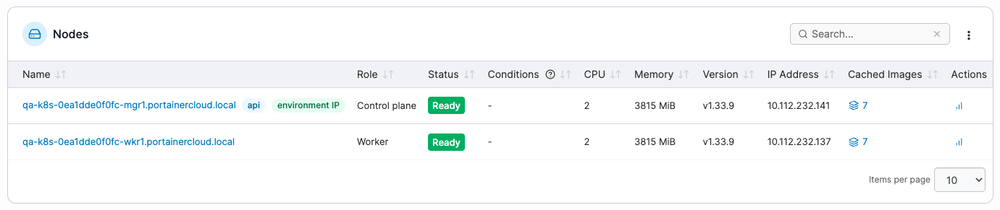
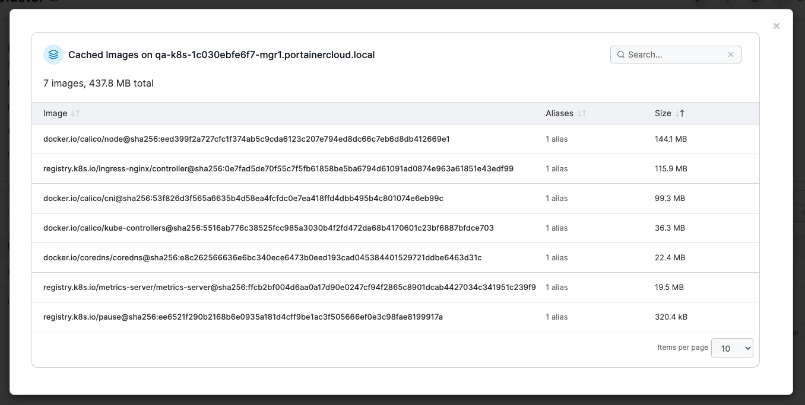
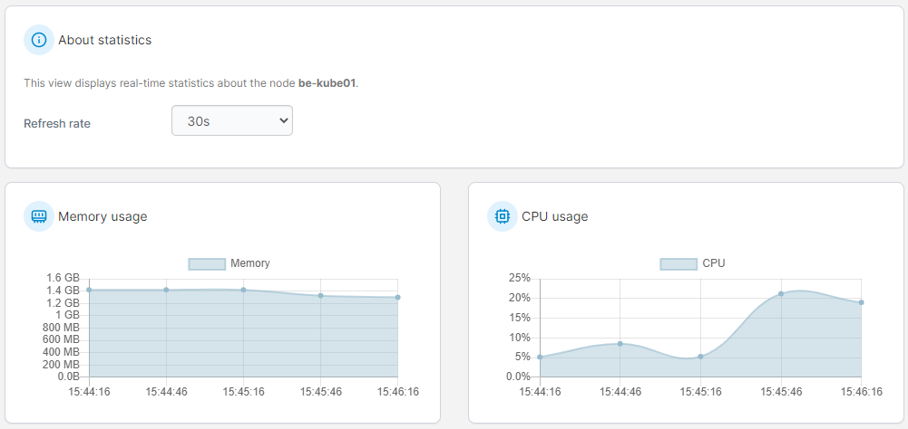

# Details

A cluster is a collection of nodes that runs containerized workloads. Portainer lets you keep track of your cluster and its individual nodes, including resource usage and configuration.

From the menu expand the **Cluster** section and select **Details**.

<figure><figcaption></figcaption></figure>

The following information is provided:

| Attribute          | Overview                                                                                                                                                       |
| ------------------ | -------------------------------------------------------------------------------------------------------------------------------------------------------------- |
| Memory reservation | The amount of memory available to the cluster.                                                                                                                 |
| Memory used        | The amount of memory used by the cluster. This is only visible if you have [enabled using the metrics API](../setup.md#enable-features-using-the-metrics-api). |
| CPU reservation    | The amount of CPU that has been reserved in the cluster.                                                                                                       |
| CPU used           | The amount of CPU used by the cluster. This is only visible if you have [enabled using the metrics API](../setup.md#enable-features-using-the-metrics-api).    |

<figure><figcaption></figcaption></figure>

## Omni cluster management


This section only appears when the environment is a [Talos Kubernetes cluster provisioned by Portainer through Omni](../../../../admin/environments/add/kube-create/omni.md).


In this section you can see and update the versions of Kubernetes and Talos on your Talos Kubernetes cluster provisioned by Portainer.


This functionality is in beta and only tested with some configurations.


<figure><figcaption></figcaption></figure>

## GPU

The GPU section is available for environments where GPU nodes are detected. The GPU table shows the readiness status of each node (`Ready` / `Degraded` / `Not Available`), and a breakdown of GPU capacity, allocatable, allocated, and available counts per `nvidia.com/*` resource type. The total GPU-capable nodes count and Degraded nodes count are shown at the bottom, along with GPU operator detected and device plugin detected badges where applicable. To be taken to the [GPU details view](./#gpu), select **View GPU details**.

<figure><figcaption></figcaption></figure>

## Nodes

This section lists the nodes in your cluster with information about each node. To view [details of a specific node](node.md), click the name of the node in the list.

<figure><figcaption></figcaption></figure>

The **Conditions** column shows any conditions that are currently active on the node. If no conditions are displayed, this indicates the node is healthy. Any active conditions (DiskPressure, MemoryPressure, PIDPressure, NetworkUnavailable) will be displayed for the particular node.

The **Cached images** column shows the number of cached images on each node. Click the displayed number to view a list of those images, including details of the image size and alias count.

<figure><figcaption></figcaption></figure>

To view usage stats for a node, including details of memory usage and CPU usage, click the **stats icon** under **Actions.**


Node stats are only available when you have [enabled features using the metrics API](../setup.md#enable-features-using-the-metrics-api).


<figure><figcaption></figcaption></figure>

To open a dedicated shell for the node, click the Shell **>\_** icon under **Actions**.&#x20;


Opening the node shell is only available to admins when [enabled node shell for admins](../setup.md#enable-node-shell-for-admins) has been enabled. This feature is disabled by default.&#x20;



This feature is avaliable on Business Edition only.&#x20;


<figure><figcaption></figcaption></figure>

On Talos Kubernetes or MicroK8s environments provisioned with the [Create a Kubernetes cluster](../../../../admin/environments/add/kube-create/) feature, you will also see buttons to add and remove nodes as well as additional action icons on MicroK8s environments to view the MicroK8s status (for control plane nodes) and to connect to the environment via SSH console.

If you need to adjust elements of your Kubernetes configuration you can do so by selecting **Setup** in the left menu.


[setup.md](../setup.md)


If you would like to define security constraints on the pods in your environment, select **Security constraints**.


[security.md](../security.md)

