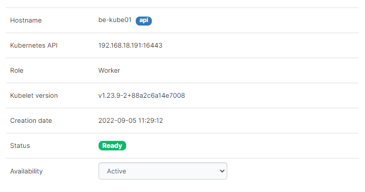
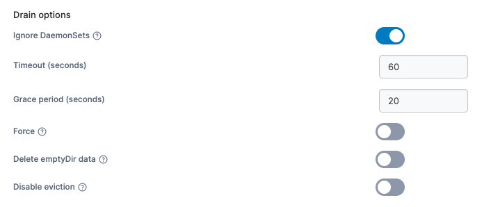
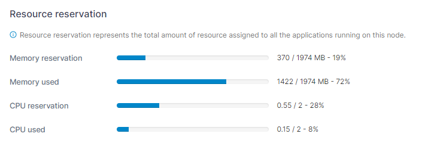
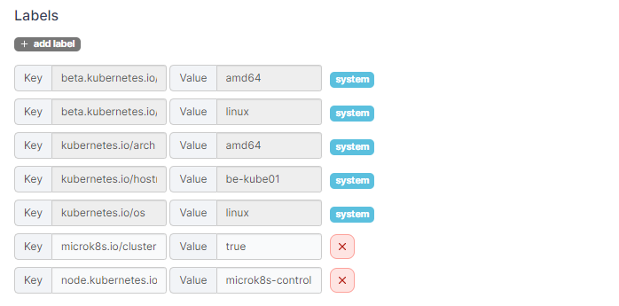
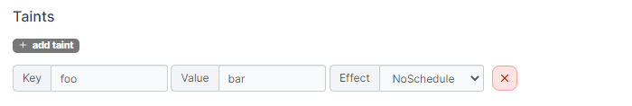
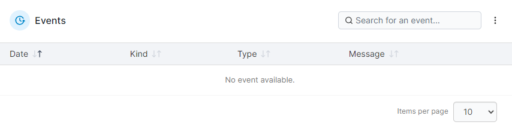
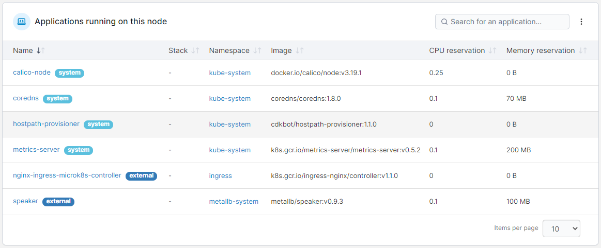

# Inspect a node

To view details of an individual node in your cluster, from the menu expand **Cluster** and select **Details**, then scroll down and click on the name of the node you want to inspect.

<figure><figcaption></figcaption></figure>

Information about the cluster is separated into three screen tabs: **Node**, **Events**, and **YAML**. An **Applications running on this node** section remains at the bottom of the page.

## Node

The **Node** tab summarizes the following information about the selected node:

| Field/Option    | Overview                                                                                                                                                                                                         |
| --------------- | ---------------------------------------------------------------------------------------------------------------------------------------------------------------------------------------------------------------- |
| Hostname        | The hostname of the node.                                                                                                                                                                                        |
| Kubernetes API  | The address and port of the Kubernetes API for this node.                                                                                                                                                        |
| Role            | The role of the node.                                                                                                                                                                                            |
| Kubelet version | The version of kubelet on the node.                                                                                                                                                                              |
| Creation date   | The date when this node was created.                                                                                                                                                                             |
| Status          | The status of the node.                                                                                                                                                                                          |
| Availability    | Defines the availability of the node. Options are **Active**, **Pause** and **Drain**.  If drain is selected, continue to configure the availability by defining the [**Drain options**](node.md#drain-options). |

<figure><figcaption></figcaption></figure>

#### Drain options

When drain is selected as the node availability, the drain options can be configured as defined below.

| Field/Option           | Overview                                                                                                                                                                                                                         |
| ---------------------- | -------------------------------------------------------------------------------------------------------------------------------------------------------------------------------------------------------------------------------- |
| Ignore DaemonSets      | Ignore DaemonSet-managed pods. These are skipped because they are recreated by their controller and would otherwise block the drain.                                                                                             |
| Timeout (seconds)      | How long to wait for the drain to complete before giving up. Increase this for nodes with many pods or pods with long shutdown routines.                                                                                         |
| Grace period (seconds) | Overrides each pod's termination grace period. `-1` use whatever grace period each pod already has configured in its own spec.                                                                                                   |
| Force                  | Allows deletion of standalone pods that aren't managed by any controller (Deployment, ReplicaSet, Job, DaemonSet, StatefulSet).                                                                                                  |
| Delete emptyDir data   | Allows eviction of pods using `emptyDir` volumes. Any data in those volumes is lost when the pod is deleted.                                                                                                                     |
| Disable eviction       | Deletes pods directly instead of using the Eviction API, which bypasses any PodDisruptionBudgets protecting your applications. Use only if a drain is stuck because a PodDisruptionBudget won't allow enough pods to be evicted. |

<figure><figcaption></figcaption></figure>

### Resource reservation

This section provides details about resource reservations assigned on the node as well as the node's resource usage.


**Memory used** and **CPU used** are only displayed if you have [enabled using the metrics API](../setup.md#enable-features-using-metrics-server).


<figure><figcaption></figcaption></figure>

### Labels

This section lists the labels that apply to the node. You can add additional labels if required, as well as edit non-system labels.

<figure><figcaption></figcaption></figure>

### Taints

In this section you can add taints to prevent certain pods being deployed on the node.

<figure><figcaption></figcaption></figure>

## Events

This section shows information about node-related events.

<figure><figcaption></figcaption></figure>

## YAML


Editing the YAML in this view is only available in Portainer Business Edition.


This section shows the node YAML within an editor. To apply any changes you make within the YAML editor, select the **Apply changes** button, and select **Apply changes** if you are sure. Changes are made by calling the Kubernetes API to patch the relevant resources. Any resource removals or unexpected resource additions that you make in the YAML will be ignored. Note that editing is disabled for resources in namespaces marked as system.

<figure><figcaption></figcaption></figure>

***

## Applications running on this node

This section provides information about the applications running on the selected node. Clicking the application name will take you to the application details page for that application.

<figure><figcaption></figcaption></figure>
