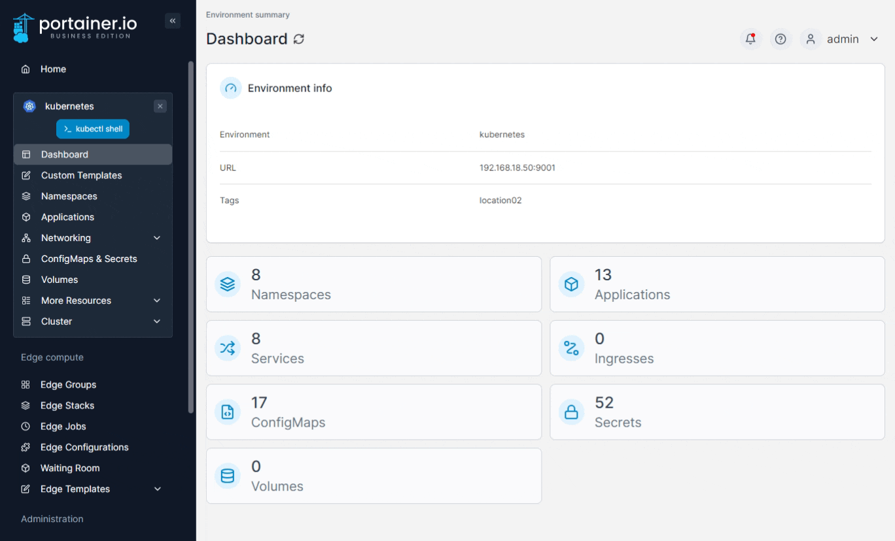
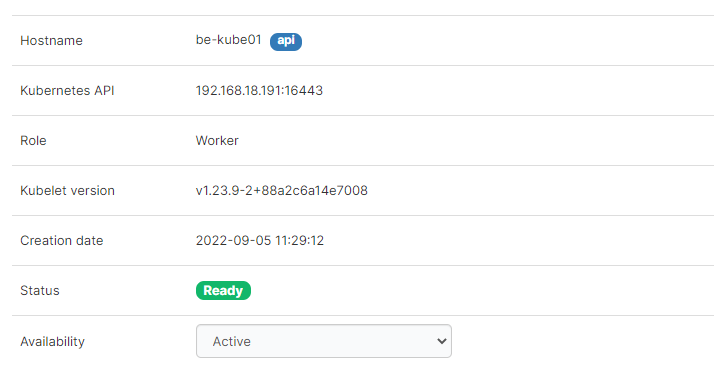
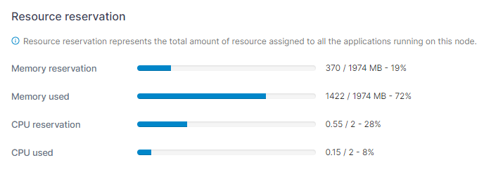
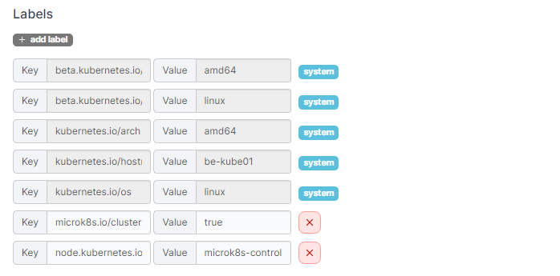
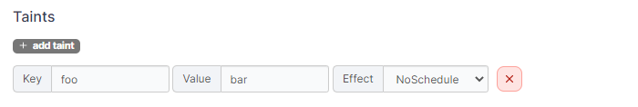
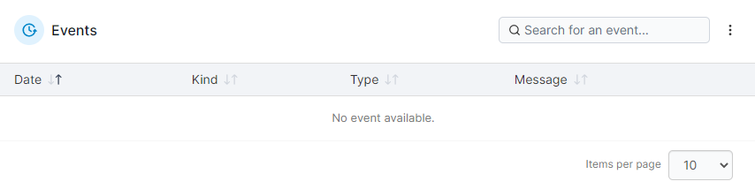
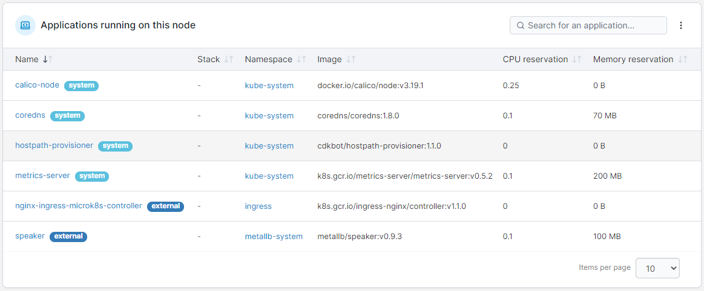

# Inspect a node

To view details of an individual node in your cluster, from the menu expand **Cluster** and select **Details**, then scroll down and click on the name of the node you want to inspect.

<figure><figcaption></figcaption></figure>

Information about the cluster is separated into two screen tabs.

## Node

The **Node** tab summarizes the following information about the selected node:

| Field/Option    | Overview                                                                               |
| --------------- | -------------------------------------------------------------------------------------- |
| Hostname        | The hostname of the node.                                                              |
| Kubernetes API  | The address and port of the Kubernetes API for this node.                              |
| Role            | The role of the node.                                                                  |
| Kubelet version | The version of kubelet on the node.                                                    |
| Creation date   | The date when this node was created.                                                   |
| Status          | The status of the node.                                                                |
| Availability    | Defines the availability of the node. Options are **Active**, **Pause** and **Drain**. |

<figure><figcaption></figcaption></figure>

### Resource reservation

This section provides details about resource reservations assigned on the node as well as the node's resource usage.&#x20;


**Memory used** and **CPU used** are only displayed if you have [enabled using the metrics API](setup.md#enable-features-using-metrics-server).


<figure><figcaption></figcaption></figure>

### Labels

This section lists the labels that apply to the node. You can add additional labels if required, as well as edit non-system labels.

<figure><figcaption></figcaption></figure>

### Taints

In this section you can add taints to prevent certain pods being deployed on the node.

<figure><figcaption></figcaption></figure>

## Events

Shows information about node-related events.

<figure><figcaption></figcaption></figure>

## Applications running on this node

This section provides information about the applications running on the selected node. Clicking the application name will take you to the application details page for that application.

<figure><figcaption></figcaption></figure>
