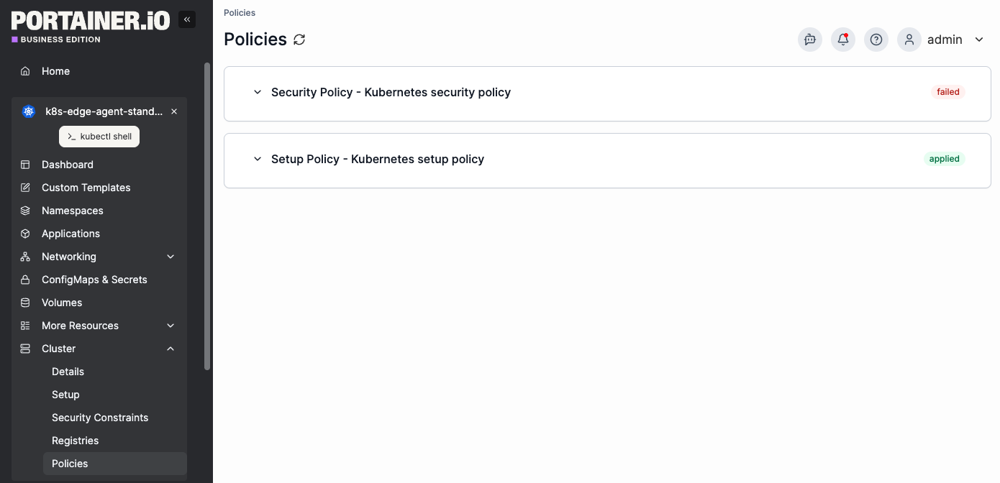

# Policies


As Policy Based Management is a beta feature, this view is only available if Policy Based Management is [enabled from the settings menu](../../../admin/settings/general.md#additional-functionality).&#x20;


To view any policies that apply to the selected environment, from the menu expand **Cluster** then select **Policies**.&#x20;

Policy details are read-only for standard users and can be updated by admin and operator users. For information on managing policies, see the [Policies](../../policy-based-management/policies/) page.&#x20;

<figure><figcaption></figcaption></figure>
