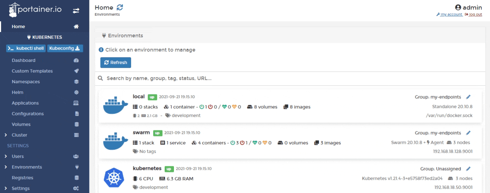
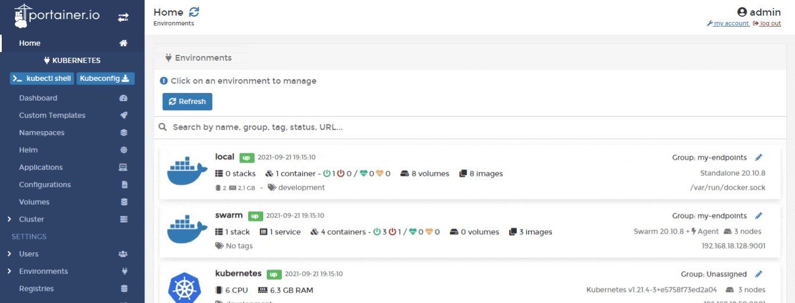
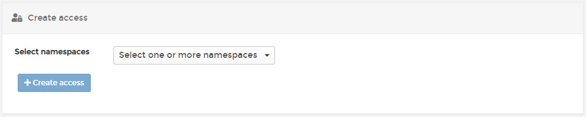

# Registries

**Registries** lets you manage access to each of the registries that are currently available.


Registry access assigned here only applies to the selected environment. It is not global.


## Adding a new registry

From the menu select **Cluster**, select **Registries** then click **Add registry**. When the global registries page appears, follow [these instructions](../../../admin/registries/add/).

## Managing access

To configure access to a registry, from the menu select **Cluster** then select **Registries**.

Find the registry you want to manage then select **Manage access**.&#x20;

From the dropdown, select the namespaces that you would like to have access, then click **Create access**.

## Browsing a registry

The registry manager extends your container management experience by giving you the ability to browse defined registries and manipulate their content. By using this feature, container users enjoy the benefit of having a single interface to manage any Docker registry deployment, providing a consistent look and feel across any provider.


Your registry must support Docker Registry API v2 in order to integrate with Portainer.


Select **Browse** next to the registry that you want to browse.

A list of the repositories within a registry, along with the number of tags for each repository appears. Select a repository to view its details.

The **Repository information** page provides the repository name, tag and image count, as well as a list of all tags. You can retag an image in order to promote it through the deployment lifecycle, or simply add or remove tags to annotate changes or usage.

This page also provides an option to clean up unused legacy images by safely deleting them. You can also remove the entire repository.


The actions you can perform on a registry may be limited by the role of your user.


