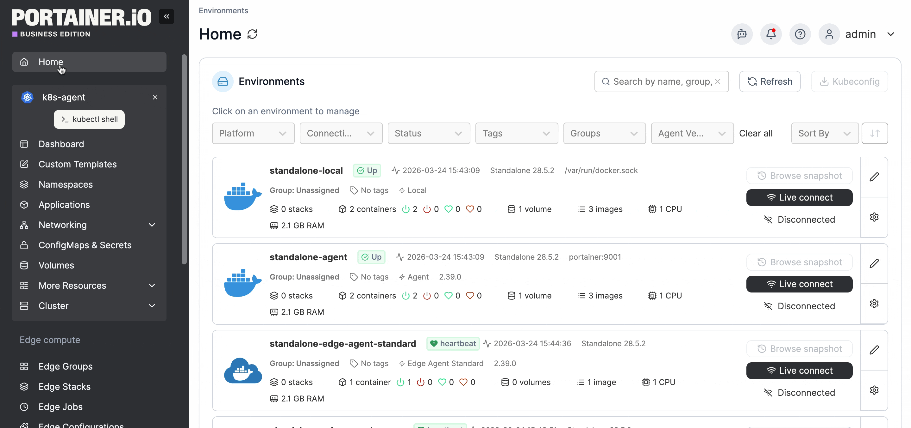
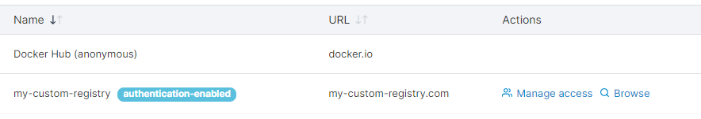
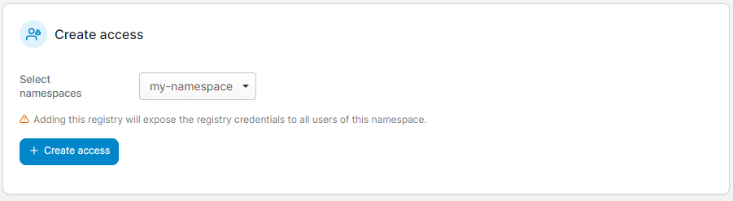
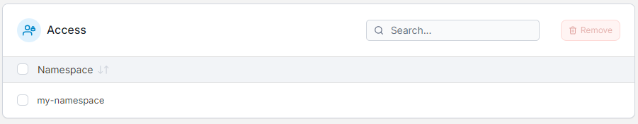
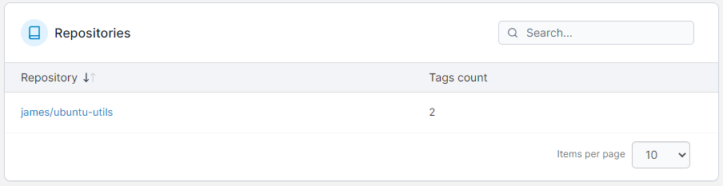
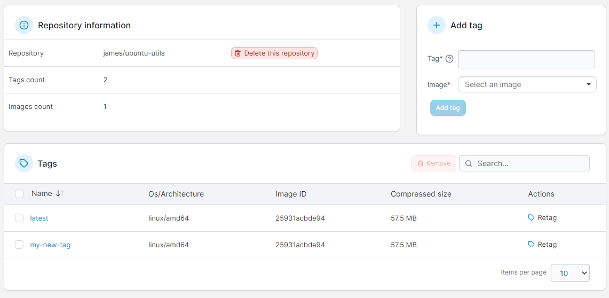

---
metaLinks:
  alternates:
    - >-
      https://app.gitbook.com/s/MdgxA76kWxcRmwybM8Ft/user/kubernetes/cluster/registries
---

# Registries


If access to an environment is being managed by a Kubernetes registry [policy](../../../admin/environments/policies/), access can not be changed or modified from this view as the policy access takes precedence.&#x20;



Registry access assigned here only applies to the selected environment. It is not global.


This view lets you manage access to each of the registries that are currently available.

## Adding a new registry

From the menu expand **Cluster**, select **Registries** then click **Add registry**. When the global registries page appears, follow [these instructions](../../../admin/registries/add/).

<figure><figcaption></figcaption></figure>

## Managing access


If access to a registry is being managed by a Kubernetes registry [policy](../../../admin/environments/policies/), access can not be changed or modified from this view as the policy access takes precedence.&#x20;


To configure access to a registry, from the menu expand **Cluster** then select **Registries**.

Find the registry you want to manage then select **Manage access**.&#x20;

<figure><figcaption></figcaption></figure>

From the dropdown, select the namespaces that you would like to have access, then click **Create access**.


When registry access is added to a namespace, Portainer creates a registry secret and adds it to the default [Service Account](../more-resources/service-accounts.md) as an imagePullSecret, allowing Pods in the namespace to pull images from the private registry automatically. When registry access is removed, Portainer deletes the registry secret and removes it from the default Service Account while retaining any other existing imagePullSecrets.


<figure><figcaption></figcaption></figure>

You can see a list of the namespaces that have access to the registry or remove a namespace's access to the registry in the **Access** section.

<figure><figcaption></figcaption></figure>

## Browsing a registry

The registry manager extends your container management experience by giving you the ability to browse defined registries and manipulate their content. By using this feature, container users enjoy the benefit of having a single interface to manage any Docker registry deployment, providing a consistent look and feel across any provider.


Your registry must support Docker Registry API v2 in order to integrate with Portainer.


Select **Browse** next to the registry that you want to browse.

A list of the repositories within a registry, along with the number of tags for each repository appears. Select a repository to view its details.

<figure><figcaption></figcaption></figure>

The **Repository information** page provides the repository name, tag and image count, as well as a list of all tags. You can retag an image in order to promote it through the deployment lifecycle, or simply add or remove tags to annotate changes or usage.

This page also provides an option to clean up unused legacy images by safely deleting them. You can also remove the entire repository.


The actions you can perform on a registry may be limited by the role of your user.


<figure><figcaption></figcaption></figure>
