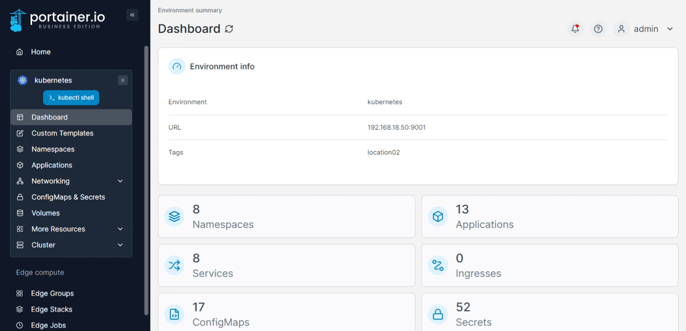

# Security constraints

Pod security policies can be used to define under what conditions workloads can run. With Portainer we achieve this by leveraging [Open Policy Agent](https://www.openpolicyagent.org/) via [OPA Gatekeeper](https://github.com/open-policy-agent/gatekeeper).&#x20;

Policies are configured on a per-environment basis. To enable and configure security policies, from the menu select a Kubernetes environment, then expand **Cluster** and click **Security constraints**.


This is advanced functionality and should be applied with caution. If a deployment attempts to create a pod that does not meet defined security constraints it may not be immediately obvious that the constraint is the reason for provision failure.


<figure><figcaption></figcaption></figure>

Toggle on **Enable pod security constraints** to enable the functionality, then toggle on the features you require and configure them as needed.


Policies are based on the [Kubernetes security policy reference](https://v1-21.docs.kubernetes.io/docs/concepts/policy/pod-security-policy/#policy-reference) - for more detail on each option check the Kubernetes documentation.


<table><thead><tr><th width="370">Field/Option</th><th>Overview</th></tr></thead><tbody><tr><td>Restrict running privileged containers</td><td>Set whether any container in a pod can enable privileged mode.</td></tr><tr><td>Restrict host namespace</td><td>Controls whether the pod containers can share the process ID namespace and host IPC namespace.</td></tr><tr><td>Restrict host networking ports</td><td>Define a range of ports that can be used by pods, on a per-network basis.</td></tr><tr><td>Restrict volume types</td><td>Define the types of volumes that may be used. Examples of volume types are <code>configMap</code>, <code>downwardAPI</code>, <code>emptyDir</code>, <code>persistentVolumeClaim</code>, <code>secret</code>, <code>projected</code>, <code>hostPath</code>, <code>flexVolume</code>.</td></tr><tr><td>Restrict host filesystem paths</td><td>Define the host paths that are allowed when using hostPath volumes.</td></tr><tr><td>Restrict drivers</td><td>Define the FlexVolume drivers that can be used.</td></tr><tr><td>Require read-only root filesystem</td><td>Specify that containers must run with a read-only root filesystem.</td></tr><tr><td>Restrict User and group ids</td><td>Controls which user ID or group ID the containers are run with or which group IDs get added. For users, specify <code>MustRunAs</code> to define specific user ID ranges, <code>MustRunAsNonRoot</code> to require non-root users, or <code>RunAsAny</code> to permit running as any user. For groups, specify <code>MustRunAs</code>, <code>MayRunAs</code> or <code>RunAsAny</code>.</td></tr><tr><td>Restrict escalation to root privileges</td><td>Controls the user privileges and prevents files from enabling extra capabilities.</td></tr><tr><td>Restrict Linux capabilities</td><td>Define the capabilities available to the pod. Set allowed capabilities to specify those capabilities that a container can use, and set Required drop capabilities to specify which privileges must be dropped from containers.</td></tr><tr><td>Restrict SELinux security context</td><td>Controls the SELinux context of the container. You can specify the level, role, type and user.</td></tr><tr><td>Restrict Proc Mount types</td><td>Defines the type of <code>/proc</code> mount to use for containers. Select either <code>Default</code> or <code>Unmasked</code>.</td></tr><tr><td>Restrict AppArmor profiles</td><td>Controls the AppArmor profile used by containers. Refer to the <a href="https://v1-21.docs.kubernetes.io/docs/tutorials/clusters/apparmor/#podsecuritypolicy-annotations">AppArmor documentation</a> for more details.</td></tr><tr><td>Restrict seccomp profiles</td><td>Controls the seccomp profile used by containers or pods.</td></tr><tr><td>Restrict sysctl profiles</td><td>Controls the sysctl profile used by containers. Specify the sysctls to forbid from use by pods.</td></tr></tbody></table>

&#x20;Once you have completed your configuration, click **Save settings** to apply your changes.
