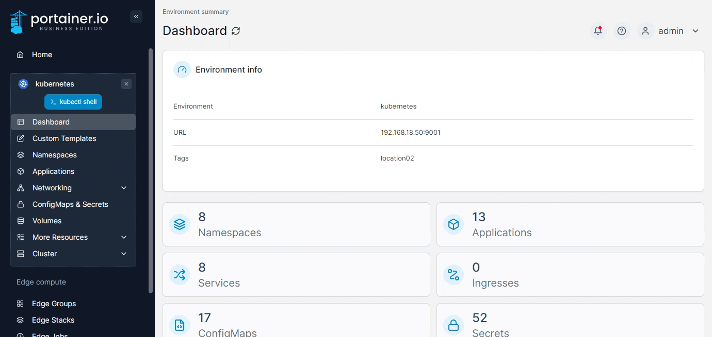
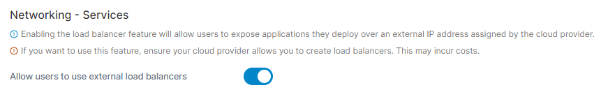
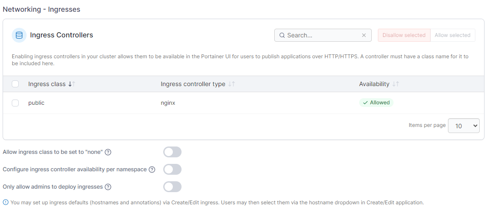
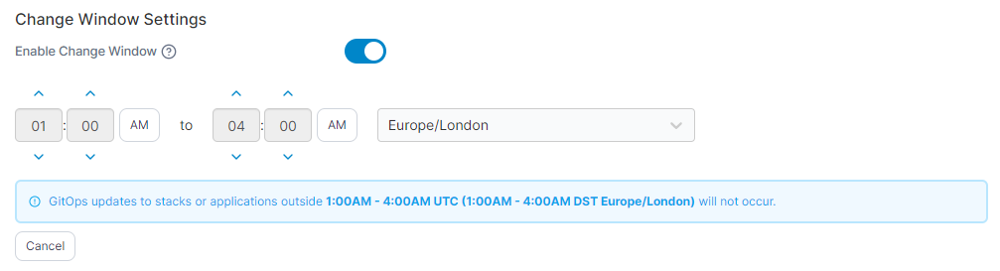
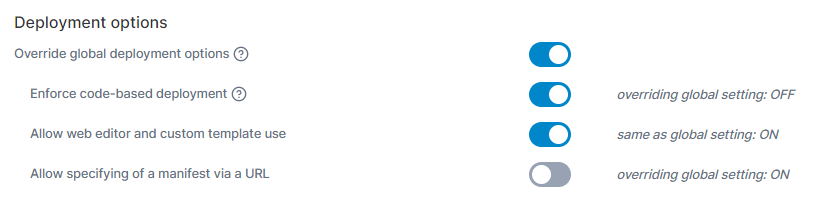
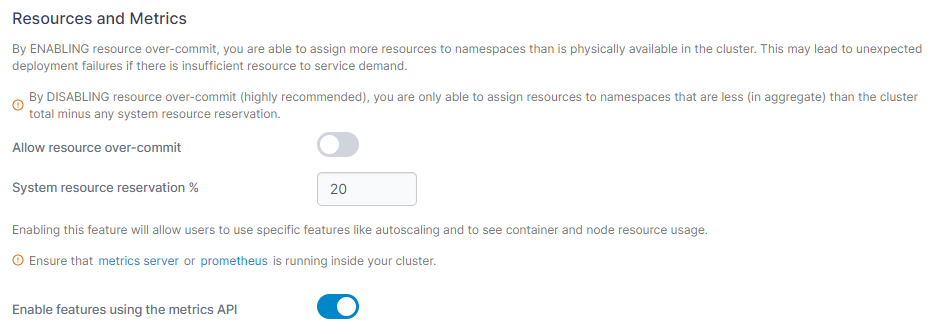
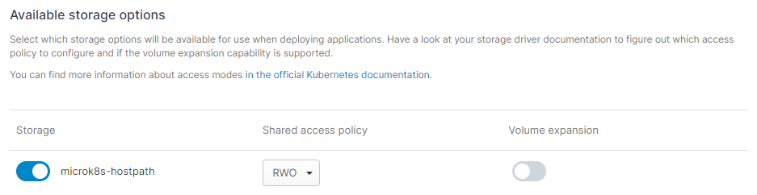

# Setup

You can make changes to your environment's Kubernetes configuration by expanding **Cluster** from the menu then selecting **Setup**.

<figure><figcaption></figcaption></figure>

## Networking - Services

### Allow users to use external load balancer


To use this feature, you need to ensure that your cloud provider allows you to create load balancers. Using this feature may incur costs from your cloud provider.


Enabling the load balancer feature will allow users to expose applications they deploy over an external IP address assigned by their cloud provider.

<figure><figcaption></figcaption></figure>

## Networking - Ingresses

Configuring ingress controllers will allow users to expose applications they deploy over a HTTP route.

Portainer auto detects and lists any ingress controllers defined in the cluster and sets them to allowed by default. As an admin you may choose to disable ingress controllers as needed.

<figure><figcaption></figcaption></figure>

Enabling **Allow Ingress class to be set to "none"** will let users create ingress objects without specifying any Ingress Class. This is useful for Kubernetes implementations where there is no `IngressClass` defined in the cluster.

Enable the **Configure ingress controller availability per namespace** toggle to be able to control Ingress Class availability further at the namespace level.

Enabling **Only allow admins to deploy ingresses** restricts the deployment of ingresses to cluster administrators only, preventing standard users from creating new ingresses.

## Change Window Settings

This setting allows you to specify a window within which [GitOps updates](../applications/manifest.md#gitops-updates) to your applications can be applied.


If this setting is enabled and an update is made to an application outside of this window, it will not be applied.


<figure><figcaption></figcaption></figure>

## Deployment Options

This section allows you to override any global deployment options set for Kubernetes environments.


This section only appears if the **Allow per environment override** option is enabled in [Settings](../../../admin/settings/#deployment-options).


| Field/Option                             | Overview                                                                                                                                                                       |
| ---------------------------------------- | ------------------------------------------------------------------------------------------------------------------------------------------------------------------------------ |
| Override global deployment options       | Enable this option to override the global deployment options for this environment.                                                                                             |
| Enforce code-based deployment            | When override is enabled, enable this option to hide the Add with form button when deploying applications and prevent the adding or editing of Kubernetes resources via forms. |
| Allow web editor and custom template use | When code-based deployment is enforced, enable this to allow the use of the web editor and custom templates when deploying an application.                                     |
| Allow specifying of a manifest via a URL | When code-based deployment is enforced, enable this allow the use of the URL option when deploying an application.                                                             |

<figure><figcaption></figcaption></figure>

## Security

### Restrict access to the default namespace

By default, a Kubernetes cluster will instantiate a default namespace when provisioning the cluster to hold the default set of pods, services, and deployments used by the cluster. If this option is enabled, the only users with the power to run applications in the default namespace are Portainer administrators.

### Restrict secret contents access for non-admins (UI only)

By default, users are able to view and edit Kubernetes secrets within the Portainer UI. Enabling this option disallows all non-admin users from doing so. Note that due to limitations within Kubernetes itself this only applies to the Portainer UI and does not prevent users from doing so through the command line or API.

<figure><figcaption></figcaption></figure>

## Resources and Metrics

### Allow resource over-commit

Enabling this feature lets you allocate more resources to namespaces than are physically available in the cluster.


**Enable** resource over-commit if you need to assign more resources to namespaces than are physically available in the cluster. This may lead to unexpected deployment failures if there are insufficient resources to meet the demand.

**Disable** resource over-commit (highly recommended) if you are only able to assign resources to namespaces that are less (in aggregate) than the cluster total, minus any system-resource reservation.


### Enable features using the metrics API


&#x20;Ensure that the Kubernetes [metrics server](https://kubernetes.io/docs/tasks/debug-application-cluster/resource-metrics-pipeline/#metrics-server) or [Prometheus](https://github.com/kubernetes-sigs/prometheus-adapter) is running inside your cluster.


Enabling this feature will allow users to use specific features that leverage the metrics API component, such as the memory and CPU usage graphs at the cluster and node level. If Portainer detects you are using a metrics server and is able to connect, this will default to on.

<figure><figcaption></figcaption></figure>

## Available storage options

Select which storage options will be available for use when deploying applications. Take a look at your storage driver documentation to figure out which access policy to configure, and whether or not the volume-expansion capability is supported. Any storage classes marked as default will be automatically set to on.

<figure><figcaption></figcaption></figure>
