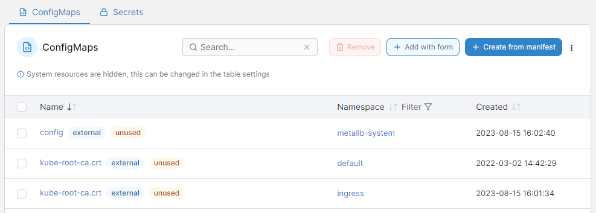
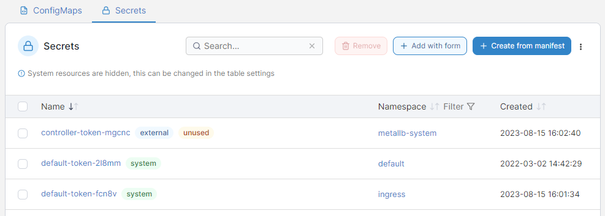

# ConfigMaps & Secrets

In Portainer you can create configurations outside of a service's image or running containers. This allows you to keep your images as generic as possible, without the need to bind-mount configuration files into the containers, or to use environment variables.


This section was previously known as **Configurations**.


This page is split into two tabs - [ConfigMaps](./#configmaps) and [Secrets](./#secrets).

## ConfigMaps

This tab displays the ConfigMaps that exist within your Kubernetes cluster. By default, system resources are hidden. To view them, click the three dot menu on the right hand side and check **Show system resources**.

<figure><figcaption></figcaption></figure>

You can filter the display of ConfigMaps by namespace by clicking **Filter** and checking the namespaces you want to see.

A ConfigMap with the **external** flag was created outside of Portainer, which means Portainer has limited knowledge on it compared to one created within Portainer. A label of **unused** means that Portainer cannot see any applications that are using this ConfigMap. This label may also appear on **external** resources because of the limited information available.

To add a new ConfigMap via a form, click the **Add with form** button. To add via a manifest, click **Create from manifest**.


[add.md](add.md)


To remove a ConfigMap, check the box next to the ConfigMap you want to remove and click the **Remove** button.

## Secrets

This tab displays the secrets that exist within your Kubernetes cluster. By default, system resources are hidden. To view them, click the three dot menu on the right hand side and check **Show system resources**.

<figure><figcaption></figcaption></figure>

You can filter the display of secrets by namespace by clicking **Filter** and checking the namespaces you want to see.

A secret with the **external** flag was created outside of Portainer, which means Portainer has limited knowledge on it compared to one created within Portainer. A label of **unused** means that Portainer cannot see any applications that are using this secret. This label may also appear on **external** resources because of the limited information available.

To add a new secret via a form, click the **Add with form** button. To add via a manifest, click **Create from manifest**.


[add-1.md](add-1.md)


To remove a secret, check the box next to the secret you want to remove and click the **Remove** button.
