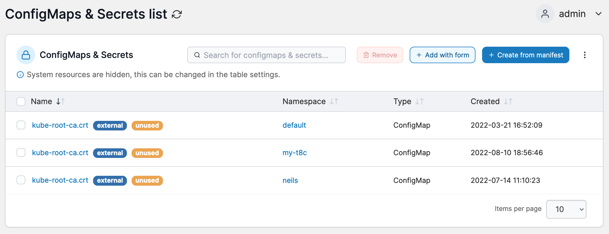

# ConfigMaps & Secrets

In Portainer you can create configurations outside of a service's image or running containers. This allows you to keep your images as generic as possible, without the need to bind-mount configuration files into the containers, or to use environment variables.


This section was previously known as **Configurations**.


<figure><figcaption></figcaption></figure>

A ConfigMap or Secret with the **external** flag was created outside of Portainer, which means Portainer has limited knowledge on it compared to one created within Portainer. A label of **unused** means that Portainer cannot see any applications that are using this ConfigMap or Secret. This label may also appear on **external** resources because of the limited information available.


[add.md](add.md)



[add-1.md](add-1.md)



[remove.md](remove.md)

