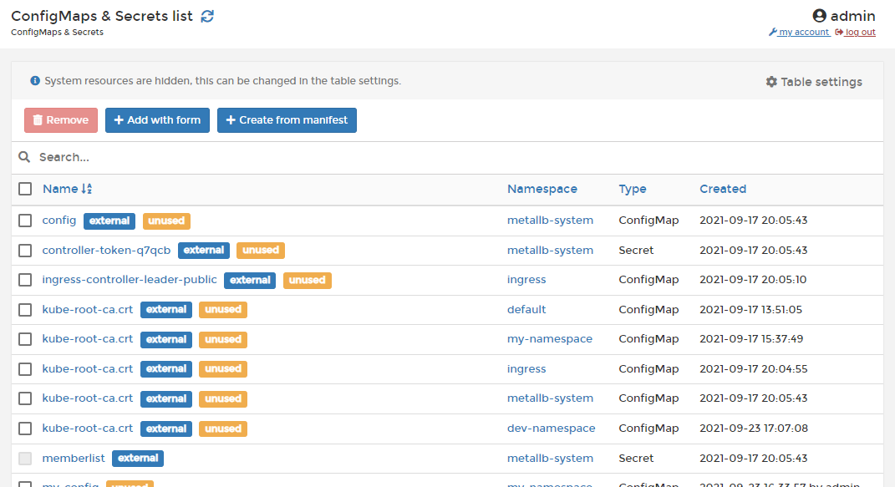

# ConfigMaps & Secrets

In Portainer you can create configurations outside of a service's image or running containers. This allows you to keep your images as generic as possible, without the need to bind-mount configuration files into the containers, or to use environment variables.


This section was previously known as **Configurations**.



[add.md](add.md)



[remove.md](remove.md)

