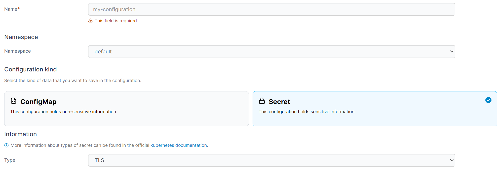
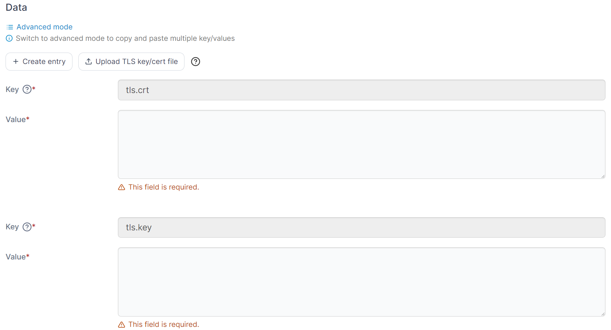
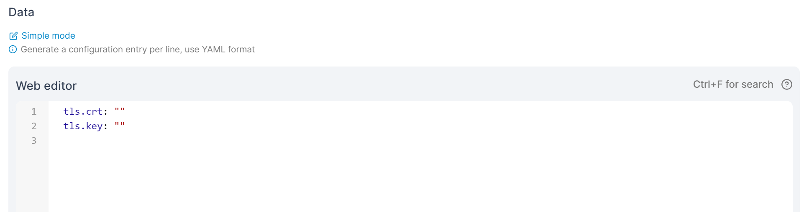

# Add a Secret

From the menu select **ConfigMaps & Secrets** then click **Add with form**.&#x20;


Secrets can also be added [using a manifest](../applications/manifest.md) by clicking **Create from manifest**.


<figure><figcaption></figcaption></figure>

Define the secret, using the table below as a guide.

| Field/Option       | Overview                                                                                                                                                                                          |
| ------------------ | ------------------------------------------------------------------------------------------------------------------------------------------------------------------------------------------------- |
| Name               | Give the secret a descriptive name.                                                                                                                                                               |
| Namespace          | Select the namespace where the secret will be saved.                                                                                                                                              |
| Configuration type | Select **Secret** from the dropdown. Secrets store sensitive information such as passwords and certificates. If you need to store non-sensitive information consider using a [ConfigMap](add.md). |
| Secret Type        | Select from the list of available secret types or select **Custom** to define your own type.                                                                                                      |

<figure><figcaption></figcaption></figure>

Data fields change to reflect the type of Data to be entered based on the secret type selection above. In the **Data** section you can enter the details of your secret, in either **Simple mode** or **Advanced mode**. Under simple mode you can add entries in a key and value format, and in advanced mode you can paste in multiple values in YAML format.

<figure><figcaption>
Adding data in Simple mode
</figcaption></figure>

<figure><figcaption>
Adding data in Advanced mode
</figcaption></figure>

When you have finished defining the secret, click **Create Secret.**
