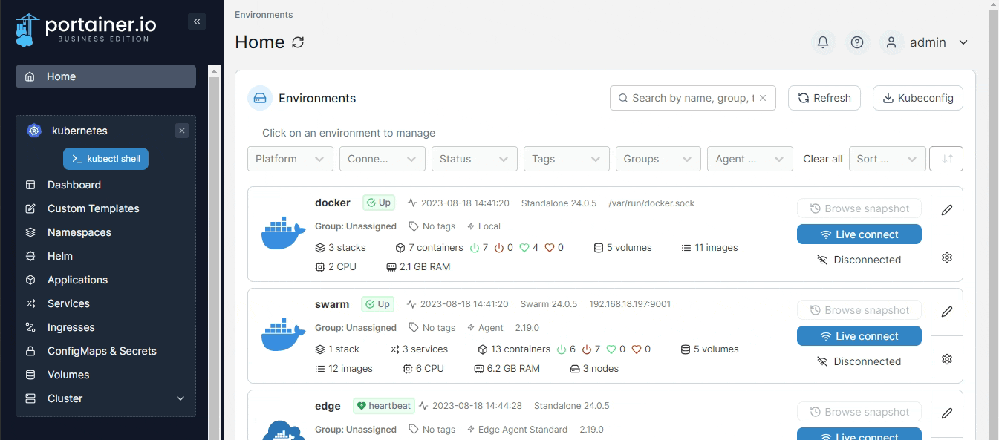
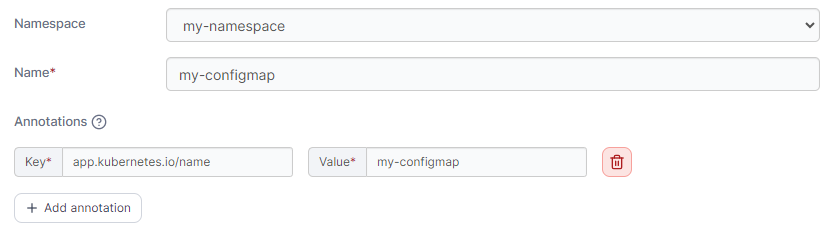
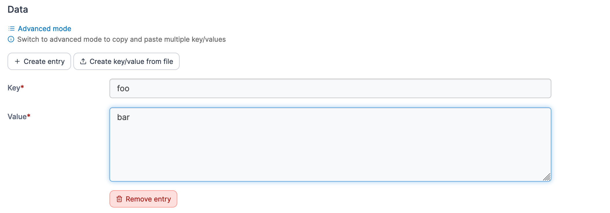
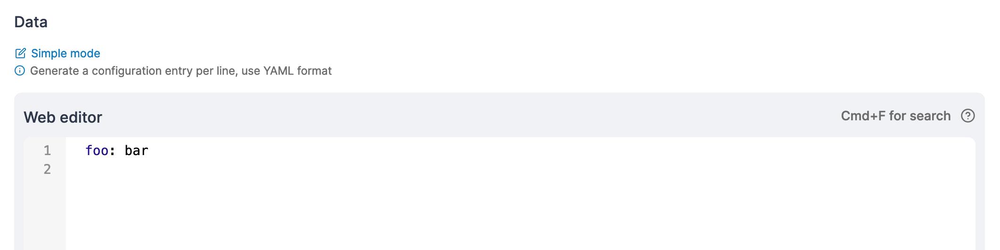

# Add a ConfigMap

From the menu select **ConfigMaps & Secrets**, ensure the **ConfigMaps** tab is selected, then click **Add with form**.&#x20;


ConfigMaps can also be added [using a manifest](../applications/manifest.md) by clicking **Create from manifest**.


<figure><figcaption></figcaption></figure>

Define the ConfigMap, using the table below as a guide.

| Field/Option | Overview                                                                                                                               |
| ------------ | -------------------------------------------------------------------------------------------------------------------------------------- |
| Namespace    | Select the namespace where the ConfigMap will be saved.                                                                                |
| Name         | Give the ConfigMap a descriptive name.                                                                                                 |
| Annotations  | You can add annotations to your ConfigMap as required by clicking **Add annotation** and filling in the **Key** and **Value** fields.  |

<figure><figcaption></figcaption></figure>

In the **Data** section you can enter the details of your ConfgMap, in either **Simple mode** or **Advanced mode**. Under Simple mode you can add entries in a key and value format, and in Advanced mode you can paste in multiple values in YAML format.

<figure><figcaption>
Adding data in Simple mode
</figcaption></figure>

<figure><figcaption>
Adding data in Advanced mode
</figcaption></figure>

When you have finished defining the ConfigMap, click **Create ConfigMap.**
