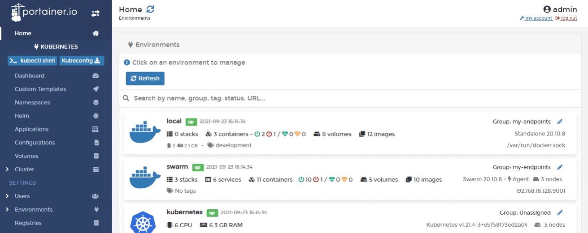
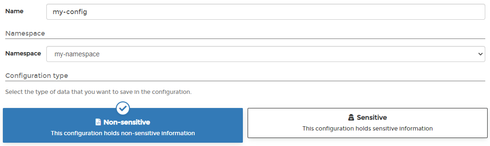
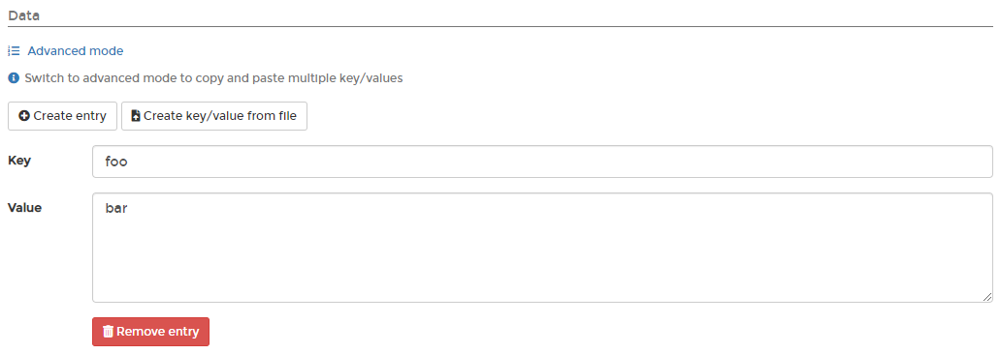
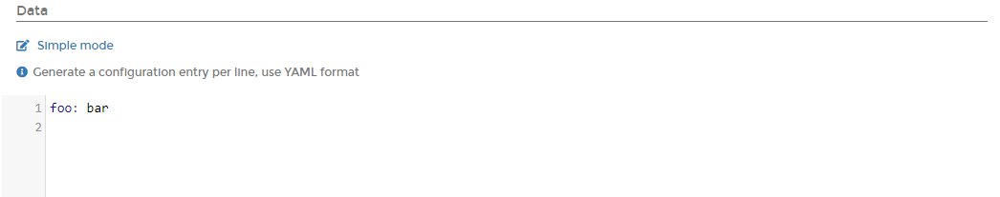

# Add a new configuration

From the menu select **Configurations** then click **Add configuration with form**. 


Configurations can also be added [using a manifest](../applications/manifest.md) by clicking **Create from manifest**.


Define the configuration, using the table below as a guide.

<table>
  <thead>
    <tr>
      <th style="text-align:left">Field/Option</th>
      <th style="text-align:left">Overview</th>
    </tr>
  </thead>
  <tbody>
    <tr>
      <td style="text-align:left">Name</td>
      <td style="text-align:left">Give the configuration a descriptive name.</td>
    </tr>
    <tr>
      <td style="text-align:left">Namespace</td>
      <td style="text-align:left">Select the namespace where the configuration will be saved to.</td>
    </tr>
    <tr>
      <td style="text-align:left">Configuration type</td>
      <td style="text-align:left">
        
Select one of the following options:

        

        
<b>Non-sensitive</b>: The configuration will not store any sensitive information.

        
<b>Sensitive</b>: The configuration will store sensitive information such
          as passwords and certificates.

      </td>
    </tr>
  </tbody>
</table>

In the **Data** section you can enter the details of your configuration, in either **Simple mode** or **Advanced mode**. Under Simple mode you can add entries in a key and value format, and in Advanced mode you can paste in multiple values in YAML format.

When you have finished defining the configuration, click **Create configuration**.

