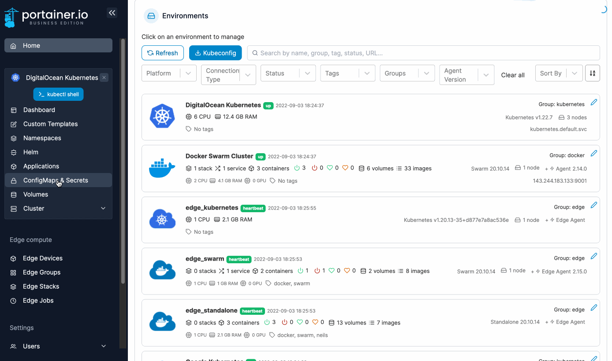
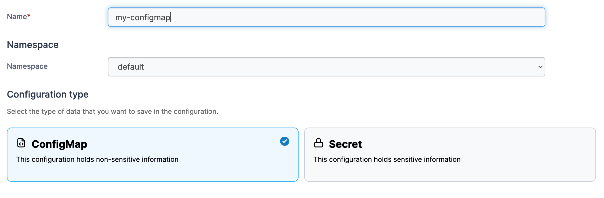

# Add a new configuration

From the menu select **ConfigMaps & Secrets** then click **Add with form**.&#x20;


Configurations can also be added [using a manifest](../applications/manifest.md) by clicking **Create from manifest**.


<figure><figcaption></figcaption></figure>

Define the configuration, using the table below as a guide.

| Field/Option       | Overview                                                                                                                                                                                                                                                                |
| ------------------ | ----------------------------------------------------------------------------------------------------------------------------------------------------------------------------------------------------------------------------------------------------------------------- |
| Name               | Give the configuration a descriptive name.                                                                                                                                                                                                                              |
| Namespace          | Select the namespace where the configuration will be saved to.                                                                                                                                                                                                          |
| Configuration type | 
Select one of the following options:

<strong>ConfigMap:</strong> The configuration will not store any sensitive information. 

<strong>Secret:</strong> The configuration will store sensitive information such as passwords and certificates.
 |

<figure><figcaption></figcaption></figure>

In the **Data** section you can enter the details of your configuration, in either **Simple mode** or **Advanced mode**. Under Simple mode you can add entries in a key and value format, and in Advanced mode you can paste in multiple values in YAML format.

<figure><figcaption>
Adding data in Simple mode
</figcaption></figure>

<figure><figcaption>
Adding data in Advanced mode
</figcaption></figure>

When you have finished defining the configuration, click **Create ConfigMap** or **Create Secret** (depending on the configuration type chosen earlier).
