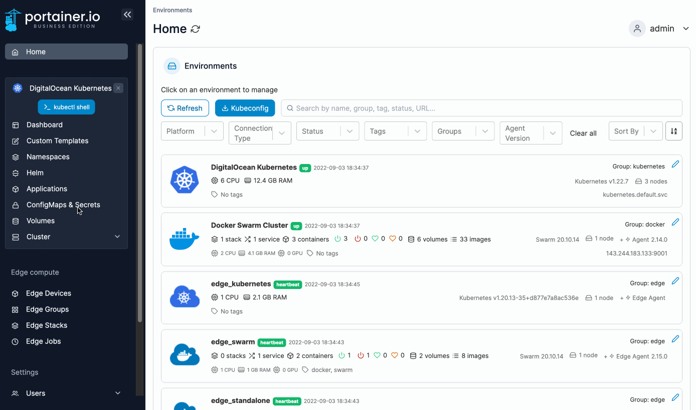
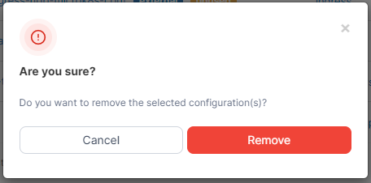

# Remove a configuration

From the menu select **ConfigMaps & Secrets**, tick the checkbox next to the configuration you want to remove then click **Remove**.

<figure><figcaption></figcaption></figure>

When the confirmation message appears, click **Remove**.

<figure><figcaption></figcaption></figure>

