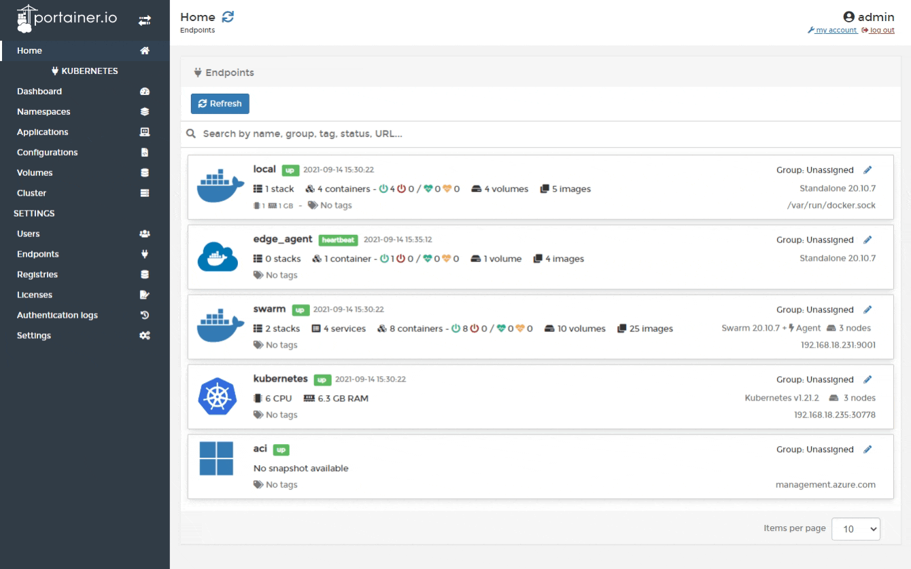
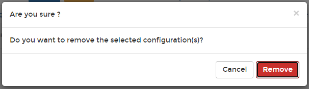

# Remove a configuration

From the menu select **Configurations**, tick the checkbox next to the configuration you want to remove then click **Remove**.

When the confirmation message appears, click **Remove**.

