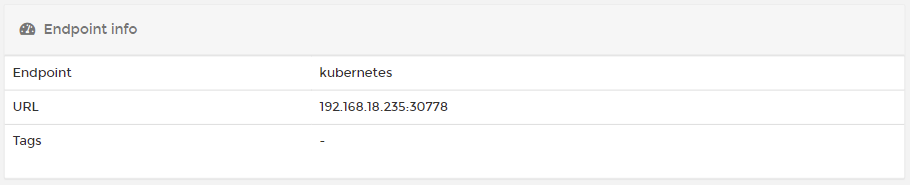

# Dashboard

The Kubernetes dashboard summarizes your Kubernetes endpoint and shows the components that make up the environment. 

## Endpoint info

This section shows the endpoint name, its URL and port, along with any [tags](../../admin/endpoints/tags.md#tagging-an-endpoint).

## Summary tiles

The remaining dashboard is made up of tiles showing the number of [namespaces](namespaces/), [applications](applications/), [configurations](configurations/) and [volumes](volumes/) that make up the environment.

