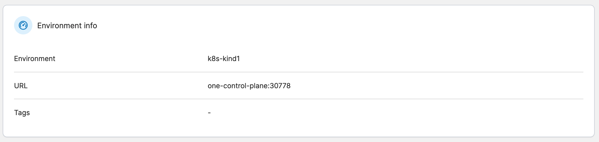
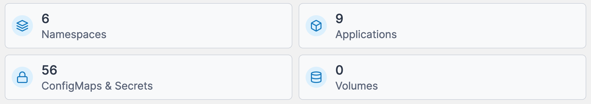

# Dashboard

The Kubernetes dashboard summarizes your Kubernetes environment and shows the components that make up the environment.&#x20;

## Environment info

This section shows the environment name, its URL and port, along with any [tags](../../admin/environments/tags.md#tagging-an-environment).

<figure><figcaption></figcaption></figure>

## Summary tiles

The remaining dashboard is made up of tiles showing the number of [namespaces](namespaces/), [applications](applications/), [configurations](configurations/) and [volumes](volumes/) that make up the environment.

<figure><figcaption></figcaption></figure>
