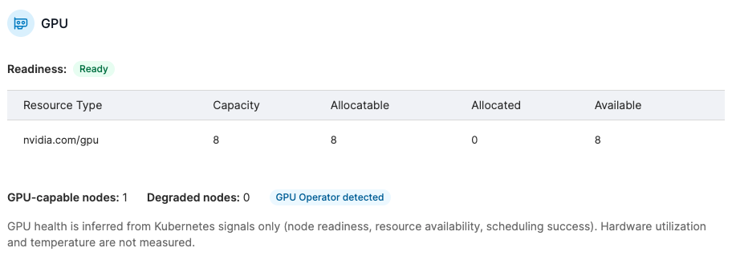
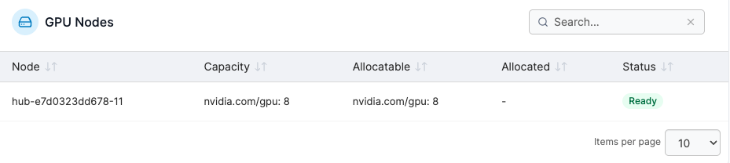
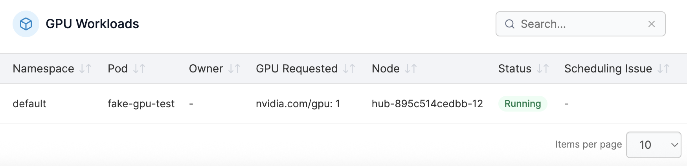

# GPU


This feature is available for Business Edition only.&#x20;


The GPU view is available for environments where GPU nodes are detected. It displays three tables: GPU, GPU Nodes, and GPU Workloads.

### GPU

The GPU table shows the readiness status of each node (`Ready` / `Degraded` / `Not Available`), and a breakdown of GPU capacity, allocatable, allocated, and available counts per `nvidia.com/*` resource type. The total GPU node count and degraded node count are shown at the bottom, along with **GPU Operator detected** and **Device plugin detected** badges where applicable.

<figure><figcaption></figcaption></figure>

### GPU Nodes

The GPU Nodes table lists each node by name with its GPU capacity, allocatable GPU count, allocated GPU count, and a status badge. If the status is not `Ready`, a reason is displayed alongside the badge.

<figure><figcaption></figcaption></figure>

### GPU Workloads

The GPU Workloads table lists pods with GPU requests, showing the namespace, pod name, owner workload, GPU requested, scheduled node, workload status, and any scheduling issues.

<figure><figcaption></figcaption></figure>
