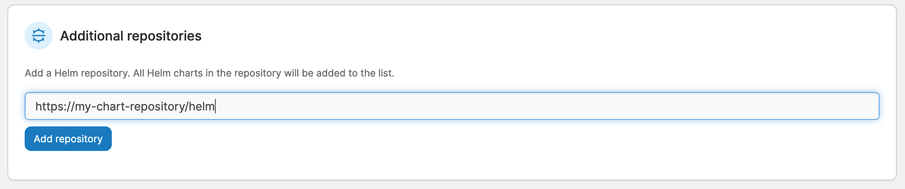
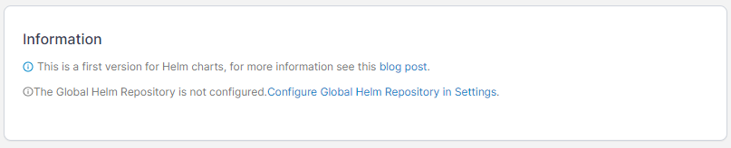
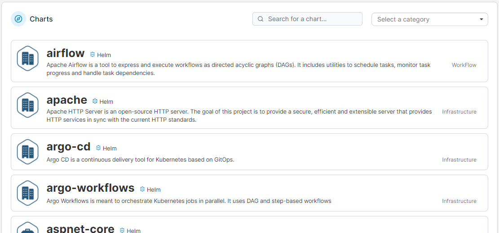

# Helm

Portainer BE 2.10 introduced support for [Helm](https://helm.sh/), the most popular packaging system for Kubernetes applications. With Helm you can deploy applications based on pre-prepared charts, either self-made or supplied by third-party repositories.


Helm support in Portainer is still in its early stages, and more functionality will be added soon. If there is specific functionality you'd like to see in a future release, [let us know](../../../contribute/contribute.md).


## Adding additional repositories

By default, Portainer ships with the [Bitnami Helm chart repository](https://bitnami.com/stacks/helm) already pre-configured. If you would like to add an additional third-party repo, enter the repository URL then click **Add repository**.

<figure><figcaption></figcaption></figure>

## Changing the pre-configured repository

You can [change the pre-configured Helm repository](../../../admin/settings/#helm-repository) if required. If you do not have a global Helm repository configured, a warning will be displayed on this page.

<figure><figcaption></figcaption></figure>

## Deploying applications from Helm charts

From the **Charts** section you can deploy an application from the Helm charts provided by the repositories you have configured. The list of charts can be filtered by category and is searchable.

<figure><figcaption></figcaption></figure>


[deploy.md](deploy.md)

