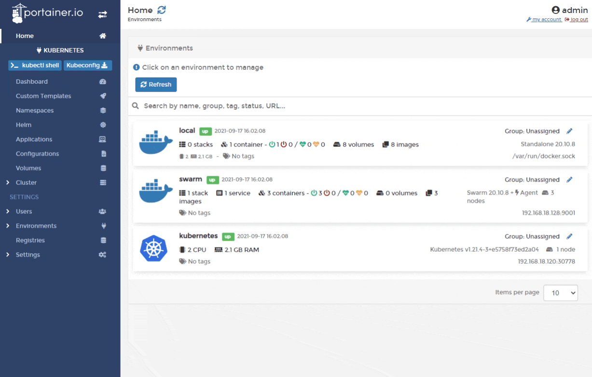
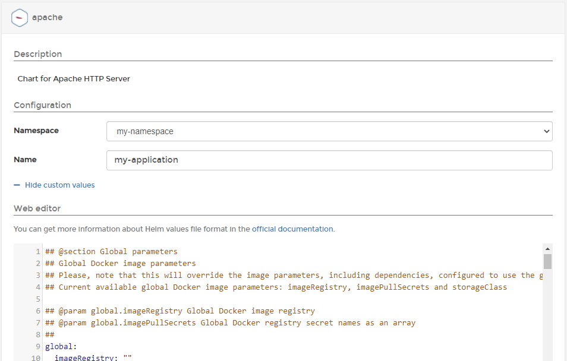

# Deploy a new application from a Helm chart

From the menu, select **Helm** then select the chart you want to deploy.

Complete the required information, using the table below as a guide.

| Field/Option       | Overview                                                                                                                                                                                                   |
| ------------------ | ---------------------------------------------------------------------------------------------------------------------------------------------------------------------------------------------------------- |
| Namespace          | Select the namespace you want to deploy your application into.                                                                                                                                             |
| Name               | Give your application a descriptive name.                                                                                                                                                                  |
| Show custom values | Click to expand the **Web editor** so you can configure any parameters required by your application. This is pulled from the `values.yaml` file provided by the chart and will differ from chart to chart. |

When you have finished, click **Install** to deploy the application.
