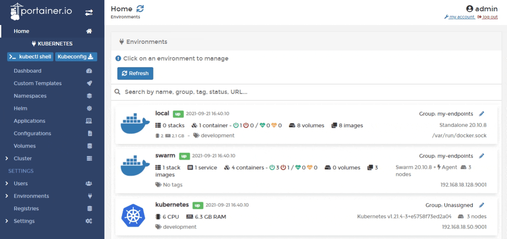

# Kubeconfig

Portainer can act as a proxy for other Kubernetes management tools, providing access to the Kubernetes cluster while still retaining the security and governance that Portainer provides. A user can download their own `kubeconfig` file and use it with their favorite tool to access the Kubernetes cluster with only the permissions afforded to that user.  
  
To generate and download your `kubeconfig` file, from the menu select **Kubeconfig**.



A downloaded `kubeconfig` file will look something like the example below.


Note that the server URL is set to the Portainer Server instance, not the Kubernetes cluster.


```yaml
apiVersion: v1
clusters:
- cluster:
    insecure-skip-tls-verify: true
    server: https://my-portainer-server:9443/api/endpoints/1/kubernetes
  name: portainer-cluster
contexts:
- context:
    cluster: portainer-cluster
    user: my-portainer-username
  name: portainer-ctx
current-context: portainer-ctx
kind: Config
preferences: {}
users:
- name: my-portainer-username
  user:
    token: xxxxxxxxxxxxxxxxxxxxxxxxxxxxxxxxxxxxxxxxxxxxxxxxxxxxxxxx
```

The context is set based on the specific user, and the token is set to never expire. You can [adjust the token expiry behavior](../../admin/settings/#kubeconfig-expiry) on the **Settings** page.


Tokens used in `kubeconfig` files become invalid when Portainer restarts — irrespective of the value set for token expiry. In this case, you will need to re-download the `kubeconfig` file.



