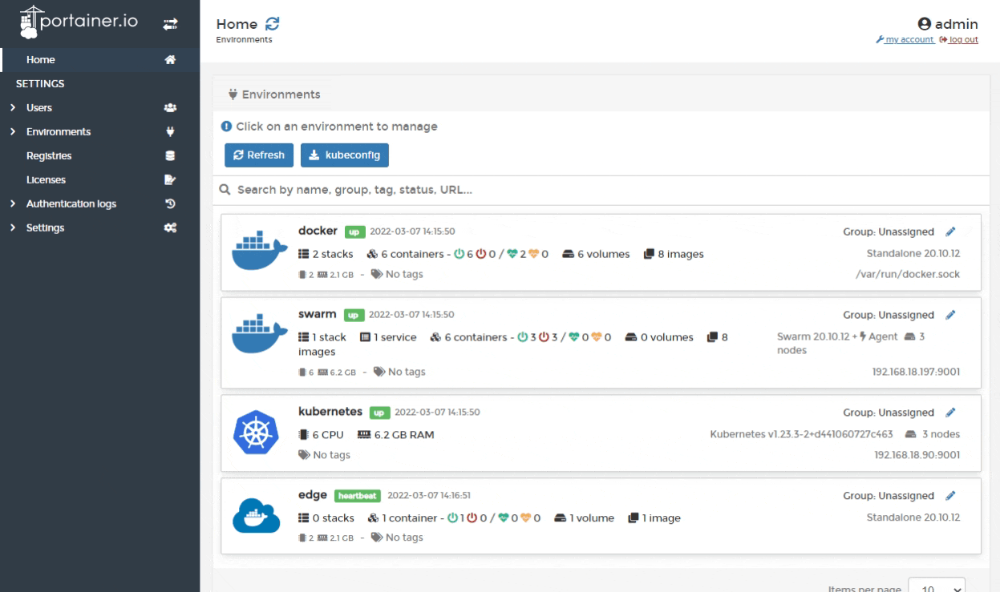
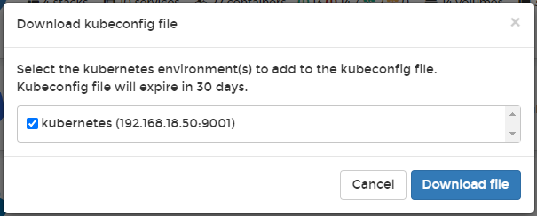

# Kubeconfig

Portainer can act as a proxy for other Kubernetes management tools, providing access to the Kubernetes cluster while still retaining the security and governance that Portainer provides. A user can download their own `kubeconfig` file and use it with their favorite tool to access the Kubernetes cluster with only the permissions afforded to that user.\
\
To generate and download your `kubeconfig` file, from the Home page click the **kubeconfig** button.



You will be asked to select the Kubernetes environments that you would like in your `kubeconfig` file. If you have configured a [kubeconfig expiry](../../admin/settings/#kubeconfig-expiry) value, this will also be shown.&#x20;



Tick the boxes for the environments you need and click **Download file**.&#x20;

A downloaded `kubeconfig` file will look something like the example below.


Note that the server URL is set to the Portainer Server instance, not the Kubernetes cluster.


```yaml
apiVersion: v1
clusters:
- cluster:
    insecure-skip-tls-verify: true
    server: https://my-portainer-server:9443/api/endpoints/1/kubernetes
  name: portainer-cluster-kubernetes
contexts:
- context:
    cluster: portainer-cluster-kubernetes
    user: portainer-sa-clusteradmin
  name: portainer-ctx-kubernetes
current-context: portainer-ctx-kubernetes
kind: Config
preferences: {}
users:
- name: portainer-sa-clusteradmin
  user:
    token: xxxxxxxxxxxxxxxxxxxxxxxxxxxxxxxxxxxxxxxxxxxxxxxxxxxxxxxx
```

Each environment in the `kubeconfig` will be accessible via contexts. Access is set based on the specific user that created the `kubeconfig` file.

Unless set to never expire, tokens will expire after the defined period, at which point a new `kubeconfig` file will need to be generated. An administrator can [adjust the token expiry behavior](../../admin/settings/#kubeconfig-expiry) on the **Settings** page.


Adjusting the token expiry will not affect previously generated `kubeconfig` files.&#x20;


