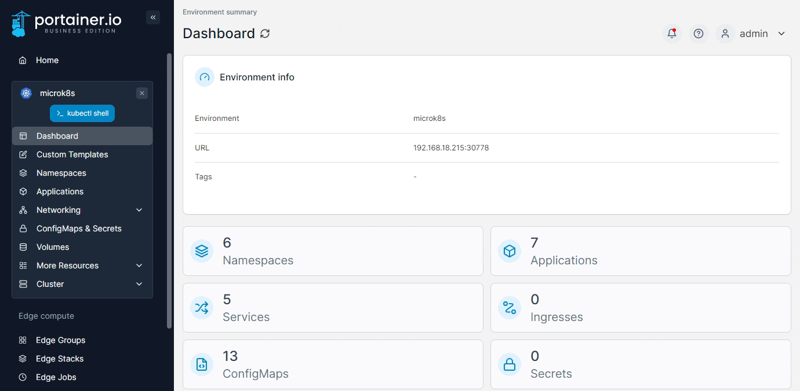

# kubectl shell

Although the Portainer UI provides access to a lot of Kubernetes functionality, sometimes you need to drop into the console. We have provided a shell within the UI that includes `kubectl` and `helm` binaries. The shell is preloaded with a `kubeconfig` for the user's context, restricting access to the permissions defined in Portainer for that user.

To access the shell, select **kubectl shell** from the menu. Once the shell loads, you can run `kubectl` and `helm` commands as needed.

<figure><figcaption></figcaption></figure>
