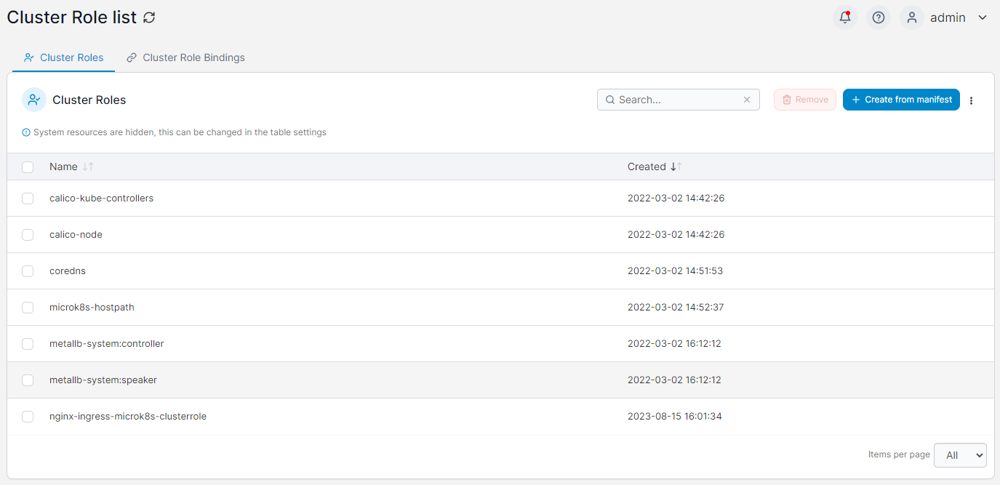
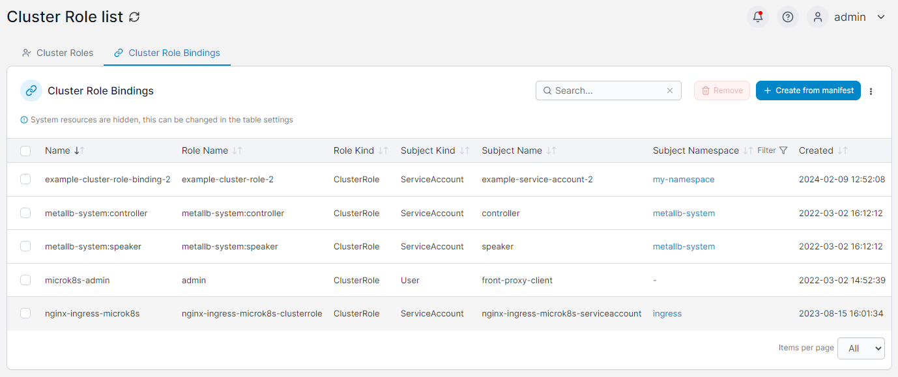

# Cluster Roles

This section lists the Cluster Roles and Cluster Role Bindings on your Kubernetes cluster. New Cluster Roles and Cluster Role Bindings can be created via the **Create from manifest** button.

Select the relevant tab to switch between Cluster Roles and Cluster Role Bindings.

## Cluster Roles

The list of Cluster Roles can be sorted by **Name** or the **Created** date. To remove a Cluster Role, check the box next to the Cluster Role you want to remove then click the **Remove** button.

<figure><figcaption></figcaption></figure>

## Cluster Role Bindings

The list of Cluster Role Bindings can be filtered by subject namespace and lists the **Name**, **Role Name**, **Role Kind**, **Subject Kind**, **Subject Name**, **Subject Namespace** and **Created** date. To remove a Cluster Role Binding, check the box next to the Cluster Role Binding you want to remove then click the **Remove** button.

<figure><figcaption></figcaption></figure>
