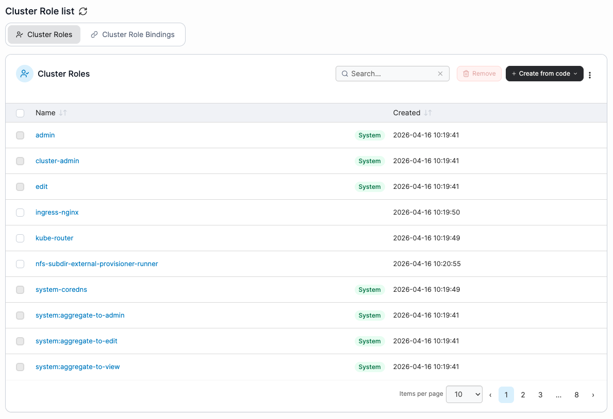
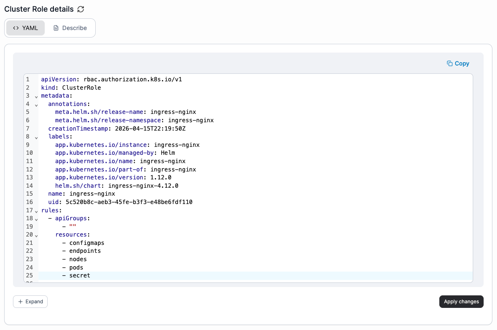
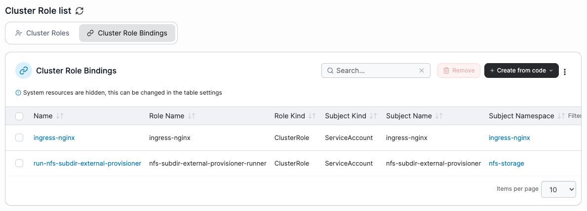
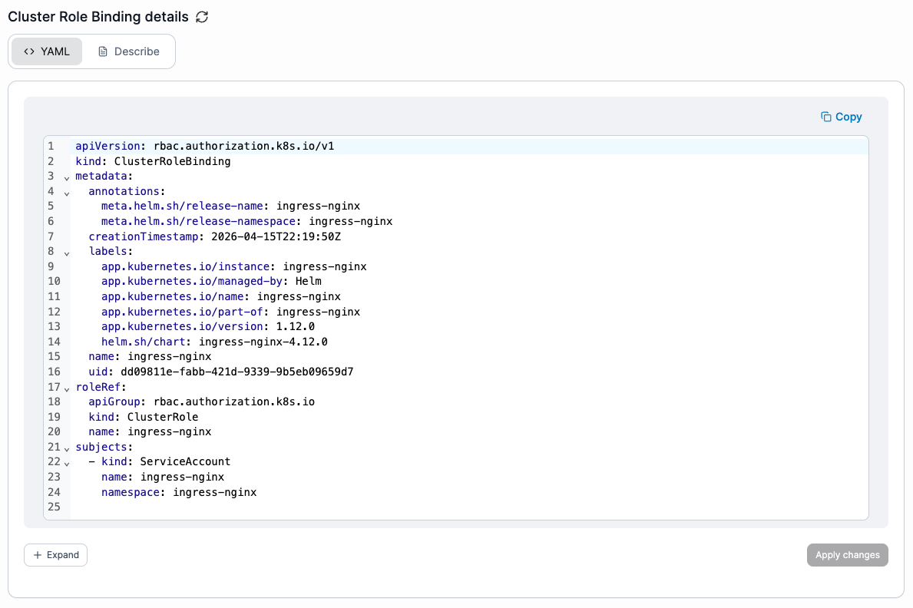

# Cluster Roles

This section lists the Cluster Roles and Cluster Role Bindings on your Kubernetes cluster. New Cluster Roles and Cluster Role Bindings can be created via the **Create from manifest** button.

Select the relevant tab to switch between Cluster Roles and Cluster Role Bindings.

## Cluster Roles

The list of Cluster Roles can be sorted by **name** or the **created** date.

To remove a Cluster Role, check the box next to the Cluster Role you want to remove then click the **Remove** button.

<figure><figcaption></figcaption></figure>

Click the cluster role **name** to open the cluster role details page, where you can view the cluster role description and edit the YAML.

To edit the cluster role YAML, select the **YAML** tab and make your changes directly in the editor. Then select **Apply changes** in the bottom-right corner to patch the modified resources through the Kubernetes API. Any removed resources or unexpected changes to resources are ignored. Resources in namespaces marked as **system** cannot be edited.

To view details of the cluster role, select the **Describe** tab.

<figure><figcaption></figcaption></figure>

## Cluster Role Bindings

The list of Cluster Role Bindings can be filtered by subject namespace and lists the **name**, **role name**, **role kind**, **subject kind**, **subject name**, **subject namespace** and **created** date.

To remove a Cluster Role Binding, check the box next to the Cluster Role Binding you want to remove then click the **Remove** button.

<figure><figcaption></figcaption></figure>

Click the cluster role binding **name** to open the cluster role binding details page, where you can view the cluster role binding description and edit the YAML.

To edit the cluster role binding YAML, select the **YAML** tab and make your changes directly in the editor. Then select **Apply changes** in the bottom-right corner to patch the modified resources through the Kubernetes API. Any removed resources or unexpected changes to resources are ignored. Resources in namespaces marked as **system** cannot be edited.

To view details of the cluster role binding, select the **Describe** tab.

<figure><figcaption></figcaption></figure>
