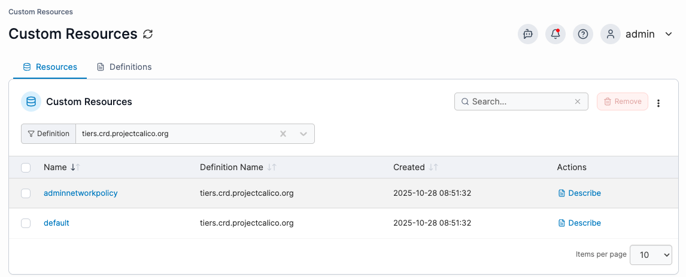
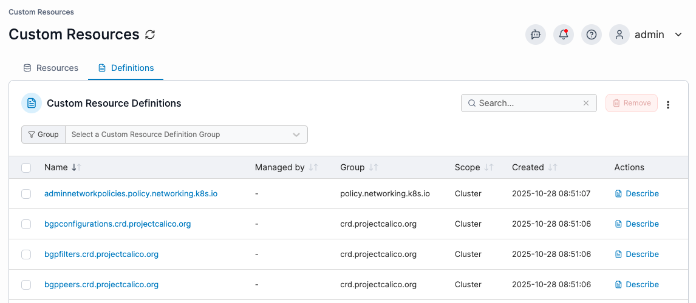

---
metaLinks:
  alternates:
    - >-
      https://app.gitbook.com/s/udjBY77rL45c6FTs07xf/user/kubernetes/more-resources/custom-resources
---

# Custom Resources


Custom resources can only be viewed by an admin user in Portainer Business Edition.&#x20;


Custom Resource Definitions (CRDs) extend the Kubernetes API to define new resource types in a cluster. From the Custom Resource view, admin users can review both Custom Resources and Custom Resource Definitions directly.&#x20;

Select the relevant tab to switch between Resources and Definitions.

<figure><figcaption></figcaption></figure>

### Resources

To view Custom Resources, under the Resources tab select a CRD first to see the resources of that type. The table shows each resource with its name, definition, creation time and available actions. Click the resource name to view the full YAML, or click the **Describe** action for a detailed summary equivalent to `kubectl describe`.

To remove a Custom Resource, tick the checkbox next to the resource you want to remove and click **Remove** in the top-right corner. You can enable auto-refresh for the table by opening the three-dot menu in the top-right corner, selecting **Auto-refresh**, and setting the refresh rate.

<figure><figcaption></figcaption></figure>

### Definitions

Under the Definitions tab, Portainer lists all installed CRDs by default, or you can narrow the list by selecting a CRD group. The table shows each definition with its name, who manages it, its group, scope, creation time and available actions. Click the definition name to view the full YAML, or click the **Describe** action for a detailed summary equivalent to `kubectl describe`.&#x20;

The **Managed by** field indicates how the CRD was installed. When the CRD was deployed by Helm, clicking the definition name will navigate to the Helm chart used to deploy the CRD. If it shows as a dash (-), the CRD was deployed by a Kubernetes YAML manifest.

To remove a CRD, tick the checkbox next to the definition you want to remove and click **Remove** in the top-right corner. You can enable auto-refresh for the table by opening the three-dot menu in the top-right corner, selecting **Auto-refresh**, and setting the refresh rate.

<figure><figcaption></figcaption></figure>
